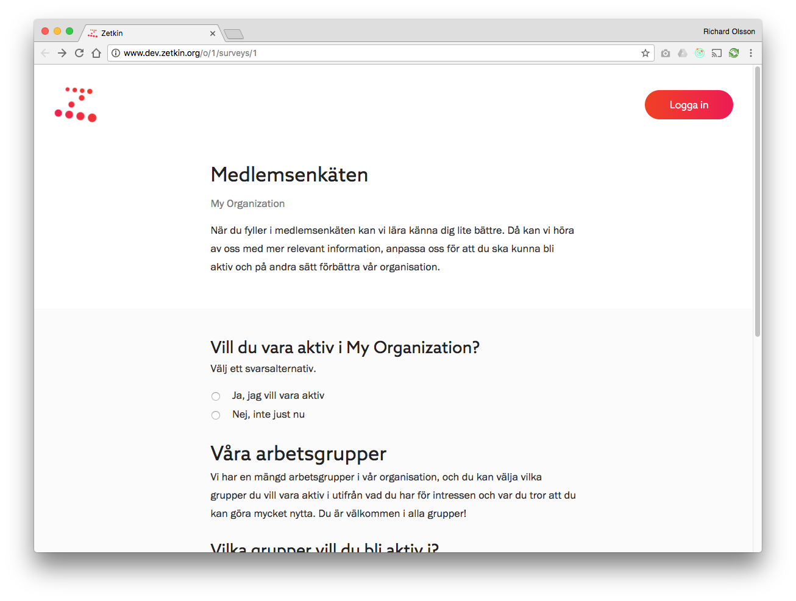

När du fyller i en enkät i Zetkin sparas informationen hos den organisation som
skapat enkäten. Du ser under namnet på enkäten när du fyller i den vilken
organisation den kommer ifrån.

## Signera eller skicka in anonymt
> Anonyma svar kan inte spåras av den organisation som utformat enkäten.

Du kan skicka in enkätsvar anonymt eller genom att signera med namn och
e-postadress. Om du är inloggad när du fyller i enkäten kan du koppla den till
din användare. För organisationen som tar emot ditt svar blir det då möjligt
att söka baserat på dina enkätsvar, exempelvis för att kunna anpassa utskick
efter dina önskemål.

Om du skickar in ett svar anonymt kan organisationen inte spåra dina svar.
