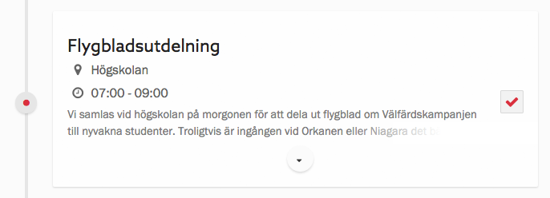
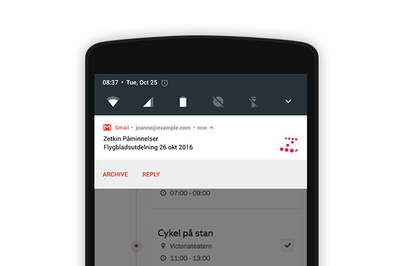

## Steg 1: Anmäl dig
Det första steget är att anmäla sig till en aktion. Det gör du genom att kryssa
i aktionen i listan på en kampanj sida eller _Min sida_.

> I anmälningsformuläret ser du vad det är för aktivitet, samt tid och plats.
> Ibland finns även en beskrivande text.

Efter anmälan kommer en funktionär i organisationen att boka in dig på passet.
Ibland kan du bli inbokad på en annan plats än den du anmält dig till, till
exempel om det är väldigt många anmälda till samma aktion.

> Glöm inte att skriva upp aktionen i din kalender.

Du kan alltid se i aktionslistan vilka aktioner du är anmäld till, och på vilka
du blivit inbokade.

## Steg 2: Vänta på påminnelse
En eller ett par dagar innan aktionen skickar organisationen ut en påminnelse
via e-post. I den kan du se vilken aktivitet, tid och plats det är som gäller,
samt vem som kommer att vara ansvarig.

Om du inte själv är ansvarig behöver du oftast inte tänka på något annat än
att dyka upp.

## Steg 3: Dyk upp och delta
När dagen för aktionen kommer behöver du bara dyka upp på utsatt tid på den
plats som stod i påminnelsen.

Den som är ansvarig ser till att lösa allt det praktiska och du behöver bara
dyka upp i tid. Svårare än så behöver det inte vara att delta!

Om du skulle behöva ställa in ditt deltagande måste du kontakta dem som är
ansvarig för aktionen eller kampanjen. Läs mer om att [ställa in](../stalla-in).
