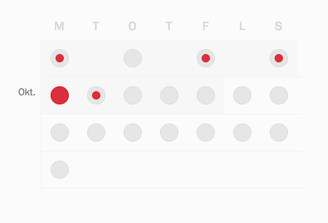
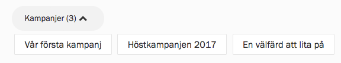

Om du är aktiv i många eller stora organisationer är det inte ovanligt att det
finns väldigt mycket att välja på. Zetkin försöker underlätta för dig att hitta
en passande aktion genom att erbjuda olika sätt att söka och filtrera:

* Navigera utifrån datum/tid
* Filtrera på kampanj
* Filtrera på typ av aktivitet
* Filtrera på plats

## Hitta aktioner ett visst datum
Om du vet vilka dagar du är lediga är det lättast att använda kalendern för att
få överblick över när det finns aktioner planerade. Kalendervyn finns alltid i
anslutning till aktionslistan och är till för att du snabbt ska kunna navigera
i listan baserat på datum.

> Osäker på vad planerad, anmäld och inbokad betyder? Läs om
> [att delta i tre steg](../att-delta-i-tre-steg).

I kalendern markeras dagar då det finns aktioner planerade med en grå cirkel.
Om du anmält dig till en aktion en viss dag markeras den dagen med en liten
röd cirkel. Om du blivit inbokad på en aktion är den röda cirkeln större.

Om du klickar på en dag i kalendern så scrollas du ner till den dagen i
aktionlistan. På så vis kan du lätt hitta aktioner en viss dag.

## Aktioner i en viss kampanj
Om dina organisationer har flera kampanjer igång samtidigt vill du sannolikt
filtrera fram de aktioner som hör till en viss kampanj. Det finns två sätt.

### Kampanjsidor
Om du befinner dig på _Min sida_ ser du alla kampanjer tillsammans, men om du
istället hamnat på en kampanjsida är aktionerna redan filtrerade. Du hittar
till en viss kampanjs sida via länkarna under "Pågående kampanjer" på _Min
sida_, eller genom att följa de kampanjlänkar som dina organisationer sprider
i sina kanaler.

### Filtrera på kampanj
Om du befinner dig på _Min sida_ kan du filtrera aktionslistan så att endast
de aktioner som tillhör en eller flera utvalda kampanjer visas.

Klicka fram filtret för kampanjer som finns i anslutning till aktionslistan,
och välj vilken eller vilka kampanjer du är intresserad av.

## Filtrera på aktiviteter eller platser
Om du vet var eller hur du vill vara aktiv kan du istället filtrera på platser
eller aktiviteter (exempelvis "flygbladsutdelning", "demonstrationsvakt" eller
"rundringning").

Att filtrera på platser och aktiviteter fungerar precis som att filtrera på
kampanjer.

När du hittat en aktion är det dags att [anmäla sig](../delta-i-tre-steg).
