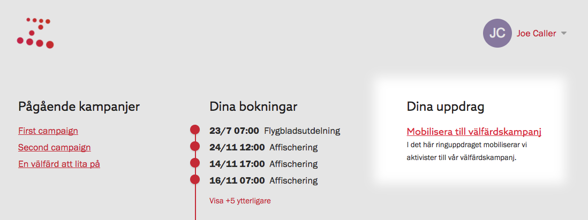

Den grupp som ringer brukar kallas för ringare. De personer som ska bli ringda
kallas för målgrupp.

För att du ska kunna ringa med Zetkin måste du ha blivit utsedd till ringare.
Du hittar dina ringuppdrag på _Min sida_, under rubriken _Dina uppdrag_.

För att [sätta igång och ringa](../samtalet) klickar du på ett uppdrag i listan.

Olika ringuppdrag har olika syften och innefattar olika metoder. Därför är det
viktigt att du sätter dig in i uppdraget [innan du börjar](../innan-du-borjar)
ringa.

## Har du inget uppdrag?
Om du vill hjälpa till men inte har fått något ringuppdrag kan du kontakta din
organisation, så kan en funktionär lägga till dig som ringare i ett ringuppdag.
