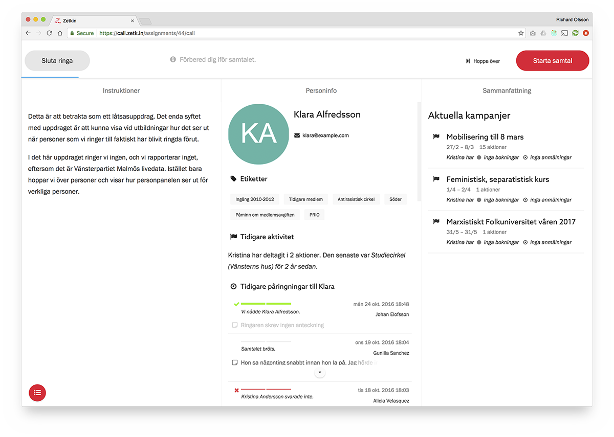

Även om du förberett dig inför ringuppdraget, har stenkoll på syftet med
ringningen, har alla material nära till hands och känner dig redo, är det klokt
att inför varje samtal förbereda sig på vem det är som kommer svara.

Inför varje samtal presentar Zetkin en hel del information om personen du just
ska ringa.

## Etiketter
Under personens namn finns eventuellt en lista på etiketter. Etiketterna sätter
organisationens funktionärer manuellt på personer hur de vill. Det innebär att
etiketterna kan innahålla information om vad som helst från exempelvis
språkkunskaper till hur personen först kom in i organisationen.

Om du för musen över en etikett kan du läsa beskrivning av vad etiketten
betyder, förutsätt att funktionärerna skrivit en sådan.

## Tidigare aktivitet
Om personen har deltagit i aktioner förut sammanfattas det här. Det totala
antalet aktioner ger en bild av hur aktiv personen är, och information om den
senaste aktionen kan utgöra grund för en bra inledning på samtalet.

## Tidigare påringningar
Du kan också se en lista över tidigare samtal med personen. Här kan det vara
intressant både att se hur ofta personen blivit ringd, när hen senast blev
ringd, och vad tidigare ringare antecknat om samtalen.

Har ni nått personen förut eller brukar de aldrig svara? Har någon tidigare
ringare skickat ett SMS eller lämnat ett telefonsvararmeddelande? Har ni
ringt tjugo gånger den senaste veckan eller inte alls på två år?

Allt detta kan påverka hur du vill prata med personen när hen svarar.

## Aktuell sammanfattning
Zetkin presenterar också en sammanfattning över personens aktuella aktivitet.
Har personen fyllt i de aktiva enkäterna, eller har hen rentav framtida
inbokningar på kampanjaktioner?
