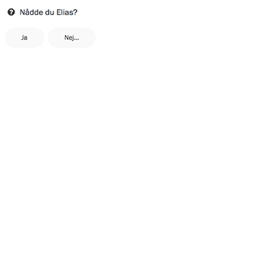

Efter samtalet får du svara på ett antal frågor. Rapporten är utformad som
en konversation, där du svarar på Zetkins frågor och gränssnittet svarar med
information om vad ditt svar innebär.

Tänk på att svara så korrekt som möjligt. Du kan alltid gå tillbaka och ändra
ditt svar på en fråga fram till dess att du skickat iväg rapporten. Om du är
osäker kan du alltid lämna ett meddelande till en organisatör.

## Nådde du personen?
Första frågan handlar om huruvida du _nådde personen_. Med _att nå personen_
menas i det här fallet att ha pratat med den person som Zetkin bett dig ringa.
Om du svarar ja får du en följdfråga om huruvida ni kunde prata till punkt eller
om personen _måste ringas upp igen_, och i så fall hur snart.

Om du svarar att du inte nådde personen får du en följdfråga om varför. Då kan
du exempelvis svara att ingen svarade, att numret var ur bruk eller att den som
svarade inte var den som söktes. Du får också svara på om du lämnade något
meddelande på telefonsvararen.

## Meddelande till organisatörer
> När du flaggat ett samtal till en organisatör kommer personen inte att bli
> ringd igen förrän organisatören godkänt det.

Härnäst får du svara på en fråga om huruvida en organisatör behöver bli
uppmärksammad på samtalet. Det kan exempelvis vara därför att något oförutsett
hände, eller för att personen bad dig göra något som du inte kan lösa själv
utan behöver delegera till en organisatör.

Om du har angivit att en organisatör behöver bli uppmärksammad på samtalet
får du möjlighet att skriva ett meddelande. Försök att vara tydlig i vad som
behöver åtgärdas. Om inget meddelande behövs kan du ange det, men då kan det
bli svårt för organisatören att förstå vad det är du vill uppmärksamma om.

Meddelande till organisatörer är inte synliga för ringare.

## Meddelande till framtida ringare
Därefter får du möjlighet att skriva en anteckning som är synlig för framtida
ringare.

> __VIKTIGT!__
> Tänk på att inte anteckna känslig information. Det kan anses oetiskt eller
> rentav vara olagligt att lagra information om exempelvis sjukdom.

Som ringare lär du dig snart vilken typ av anteckningar som är användbara.
Försök att lämna anteckningar som du själv hade haft nytta av. Vem vet, kanske
är det rentav du själv som ska ringa nästa gång det är dags.

Efter att du svarat på alla frågor sammanfattas rapporten i en lista och du
får möjlighet att skicka iväg den.

Sedan är samtalet klart, och du kan gå vidare till nästa. Om du någon gång
behöver [gå tillbaka till ett tidigare samtal](../../gora-om-ett-samtal) kan
du även göra det.
