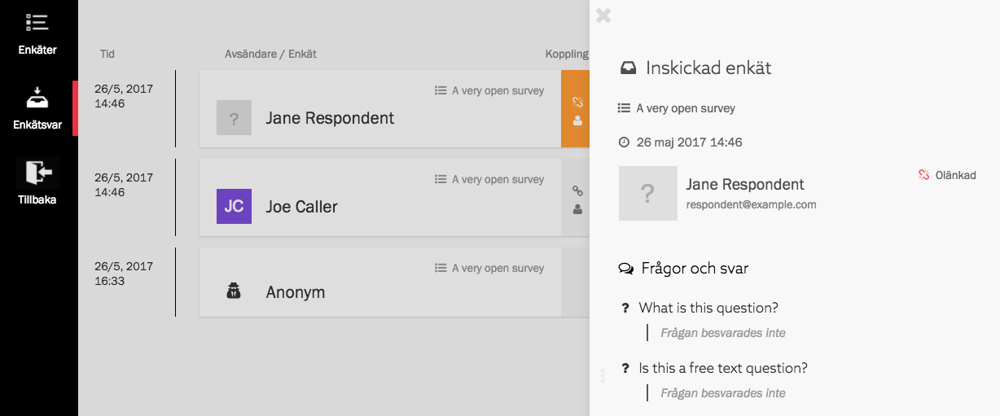
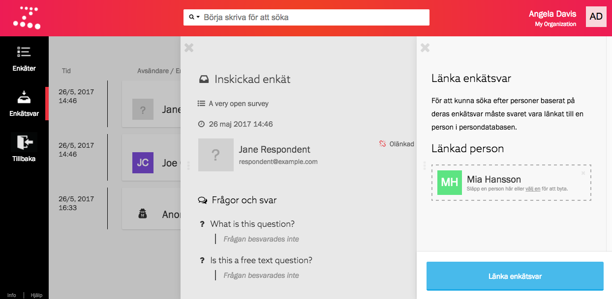

## Listan och enskilda enkätsvar
I enkätsvarslistan finns alla svar på alla din organisations enkäter. Om du
klickar på ett svar öppnas panelen _Inskickad enkät_ med information om den som
svarat, samt en sammanställning av alla besvarade frågor.

> Du kan också hitta en enskild persons enkätsvar genom att söka efter personens
> namn med sökfunktionen i Zetkin Organize.

Överst i panelen _Inskickad enkät_ hittar du namnet på enkäten som besvarats,
det datum då enkätsvaret skickats in, och information om den svarande.

## Anonyma, signerade och länkade enkätsvar
Enkätsvar kan skickas in anonymt eller signeras på två olika sätt. Alla tre
alternativ illustreras i enkätsvarslistan och panelen _Inskickad enkät_.

Anonyma enkätsvar indikeras med texten _Anonym_ i listan och _Anonym svarande_
som namn i panelen _Inskickad enkät_.

Om svaret signerats med namn och e-postadress står båda delarna i såväl lista
som panel. Om den som besvarat enkäten var inloggad har enkäten också länkats
till användarens person i din organisations persondatabas. Om så är fallet
indikeras det av personens profilbild i lista och panel, och texten _Länkad_
bredvid en grön ikon i panelen.

För att en person ska gå att hitta genom en smart sökning baserat på enkätsvar
måste enkätsvaret vara kopplat.

## Länka enkätsvar
Du kan länka om ett enkätsvar. Oftast vill du göra det ifall någon skickat in
ett enkätsvar utan att vara inloggad, men du vill kunna använda enkätsvaret för
att hitta personen med smarta sökningar och dylikt.

> Du kan också ta bort länkningen på ett enkätsvar.

Du länkar ett enkätsvar genom att öppna det i en panel och klicka på texten
_Olänkad_. Då öppnas panelen _Länka enkätsvar_. Där kan du välja en person
att länka enkätsvaret till.

Klicka på knappen _Länka enkätsvar_ när du valt en person så länkas svaret till
personen. Därefter kommer du kunna hitta personen med _Smarta sökningar_ som
baseras på enkätsvar.
