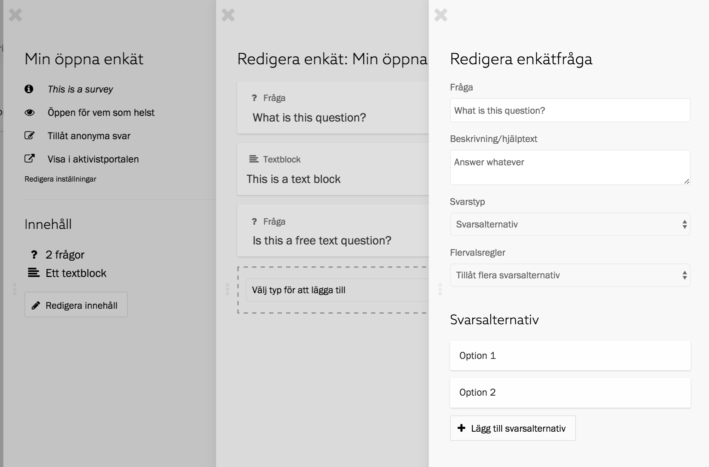

Allt innehåll i en enkät är antingen en fråga eller ett textblock. Du hittar
innehållet och kan arbeta med det i enkätpanelen i Zetkin Organize. Klicka på
_Redigera innehåll_ för att få upp en lista på alla frågor och textblock,
sorterade i den ordning de förekommer i enkäten.

## Skapa och redigera innehåll
För att redigera en befintlig fråga eller textblock klickar du på det i listan.
Då öppnas någon av panelerna _Redigera enkätfråga_ eller _Redigera textblock.

Om du vill lägga till nytt innehåll i enkäten gör du det längst ned i listan.
Där finns en lista med etiketten _Välj typ för att lägga till_.

I listan kan du välja antingen _Enkätfråga_ eller _Textblock_ för att lägga
nytt innehåll av respektive typ. När du väljer något i listan öppnas en ny
panel där du kan skriva in innehållet och ändra inställningar.

### Textblock
Förutom frågor kan enkäter innehåll textblock, d.v.s. en rubrik och en
kortfattad brödtext. Använd textblock för att inleda sektioner i enkäten,
eller för att ge mer utförliga instruktioner än vad som får plats i frågorna.

### Frågor
I en enkät är frågorna det viktigaste innehållet. Frågor i Zetkins enkäter kan
utöver själva frågotexten också kompletteras med en beskrivning eller
instruktionstext. Här kan du exempelvis förklara hur den svarande ska tänka nör
hen besvarar frågan, eller förklara mer utförligt vad som menas med frågan.

## Olika sorters frågor
När du skapar en fråga får du ange på vilket sätt frågan ska besvaras, med
fritext eller fördefinierade svarsalternativ. Du väljer en av de båda typerna
i formuläret där du redigerar frågan, under etiketten _Svarstyp_.

### Svarsalternativ
Frågor av typen _Svarsalternativ_ besvaras genom att användaren kryssar i ett
eller flera utav alternativ som du definierar i förväg. Den här typen lämpar
sig exempelvis för att svara på ja/nej-frågor eller för att välja i en lista av
olika arbetsgrupper som din organisation erbjuder.

Du måste ange huruvida det ska vara möjligt att välja flera alternativ. Det gör
du i listan _Flervalsregler_:

* _Tillåt flera svarsalternativ_ betyder att användaren kan kryssa i flera av
  de alternativ du definierar. Detta lämpar sig exempelvis för att välja vilka
  politiska områden man är intresserad av.
* _Tillåt bara ett svarsalternativ_ betyder att användaren kan kryssa i max
  ett av de fördefinierade svarsalternativen. Detta lämpar sig exempelvis för
  att svara ja eller nej på en fråga om huruvida man vill vara aktiv.

> Om du byter namn på svarsalternativ eller tar bort dem kan det påverka redan
> insamlade svar. Att göra små förändringar är inget problem, men förändra inte
> innebörden av alternativ efter att du börjat samla in svar.

Efter att du skapat en fråga med svarsalternativ kan du ange vilka alternativ
som finns. Öppna frågan i panelen _Redigera enkätfråga_ och klicka på knappen
_Lägg till svarsalternativ_ för att lägga till ett nytt alternativ.

Klicka på ett befintligt alternativ för att redigera det. När du är nöjd med
den nya texten klickar du på spara, eller på avbryt för att ångra och återgå
till den gamla formuleringen.

### Fritext
Fritextfrågor besvaras av användaren genom att själv skriva in valfri text. Det
lämpar sig bra för om du vill ge den som svarar en chans att svara helt fritt,
exempelvis på frågor om vad de tänker om en viss fråga. Fritext är också rimligt
om frågan skulle kräva alltför många svarsalternativ, exempelvis när man frågar
om språkkunskaper eller yrke.

> Tänk på att fritextfrågor är svårare att söka på. Om du vill ställa en fråga
> som går att besvara med fördefinierade svarsalternativ är det därför bättre.

Du kan ange huruvida textrutan ska vara en ensam rad eller flera rader, och på så
sätt uppmuntra till olika långa svar.

## Var försiktig med förändringar
Efter att du publicerat en enkät och börjat samla in svar kan du fortfarande
ändra i enkäten, men var då väldigt försiktig. Förändringar i enkäten kan
innebära att redan insamlad data blir svår att förstå.

Små förändringar, som korrigering av stavfel eller förtydliganden är inget
problem. Om du ändrar svarsalternativet "Japp" till "Ja" kommer gamla
"Japp"-svar också att översättas till "Ja". Större ändringar kan dock innebära
att gamla svar förändras på ett sätt som ändrar deras innebörd.

Som exempel, tänk dig en enkät med frågan "Vill du vara aktiv?". Frågan har två
svarsalternativ:

1. "Ja"
2. "Nej"

Efter att du samlat in ett antal svar kommer du på att du vill ha fler
svarsalternativ, närmare bestämt:

1. "Ja, ofta"
2. "Ja, lite"
3. "Nej, inte alls"

Du ändrar därför det första alternativet från "Ja" till "Ja, ofta", och det
andra alternativet från "Nej" till "Ja, lite", och lägger till ett nytt
alternativ, "Nej, inte alls".

En konsekvensen av denna slarviga ändring blir att alla gamla svar där den
svarande valt alternativet "Nej" fortsättningsvis kommer se ut som att hen i
själva verket valt alternativet "Ja, lite". Svaren blir alltså helt fel.

I en sådan här situation är det bättre att antingen lägga till en ny fråga där
du frågar "Hur mycket vill du vara aktiv?" efter den tidigare frågan, eller
ändra svarsalternativen på ett sätt som i mindre utsträckning förändrar deras
innebörd.

Exempelvis skulle "Ja" kunna översättas till "Ja, ofta", "Nej" blir "Nej, inte
alls", och det nya alternativ du lägger till blir "Ja, lite". Då kommer gamla
ja-svar fortfarande rapporteras som ja ("Ja, ofta") och gamla nej-svar
fortfarande rapporteras som nej ("Nej, inte alls"). Bland kommande svar kommer
även alternativet "Ja, lite" förekomma.

Att ändra i en enkät är aldrig optimalt, men ibland nödvändigt. Tumregeln är
alltså att hålla sådana ändringar så små som möjligt, och att aldrig ändra
befintliga frågor och svarsalternativ på ett sätt som gör att deras innebörd
förändras radikalt.
