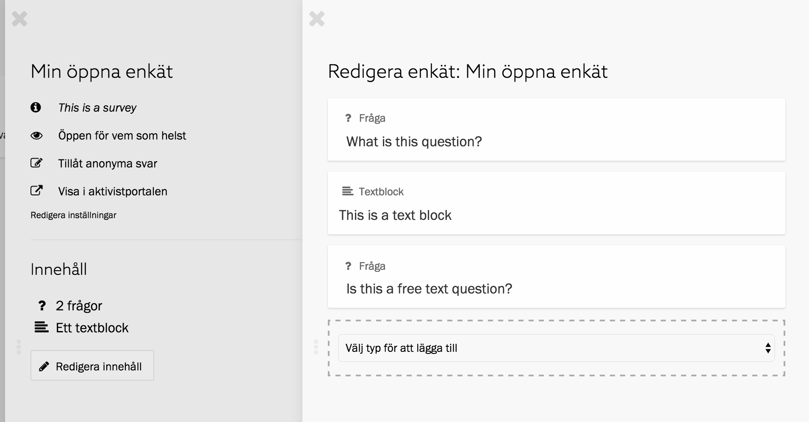

I Enkät-sektionen i Zetkin Organize hittar du din organisations enkäter. Här
kan du också skapa nya enkäter, som du bygger upp genom att lägga till frågor
och textblock.

## Skapa enkäter
Du skapar en enkät genom att klicka på knappen _Skapa ny enkät_ ovanför
enkätlistan i Enkät-sektionen. En ny panel, _Skapa enkät_ öppnas, där du kan
fylla i enkätens namn och en beskrivning som kommer vara synlig för alla som
fyller i enkäten.

Här väljer du också vem som ska kunna komma åt enkäten och vilka regler som
gäller för signering av enkätsvar.

När du skrivit ett namn och en beskrivning för enkäten, samt är klar med
inställningarna för åtkomst och signering, är du redo att gå vidare och fylla
enkäten med innehåll. Klicka på den blå knappen _Skapa enkät_. Enkäten läggs
till i din lista över enkäter, och du kan klicka på den för att redigera
innehållet eller ändra någon av de andra inställningarna.

### Regler för åtkomst
Du kan kontrollera vem som kan komma åt enkäten genom att välja mellan olika
alternativ i listan _Åtkomst_.

Alternativet _Öppen för vem som helst_ innebär att vem som helst, oavsett om man
har ett Zetkin-konto eller inte, kommer att kunna komma åt enkäten via dess
direktlänk.

Alternativet _Endast för anslutna användare_ innebär att man kan komma åt
enkäten endast om man har ett Zetkin-konto, har loggat in och är ansluten till
den organisation som äger enkäten.

### Policy för signering
Enkäter kan signeras på tre olika sätt. Inloggade användare som är anslutna till
er organisation kan signera som sig själv, vilket kopplar enkätsvaret till deras
person i er persondatabas. Detta betyder bland annat att ni kan söka fram
personen baserat på vad de svaret i enkäten.

Man kan också signera genom att manuellt mata in förnamn, efternamn och
e-postadress. Slutligen kan man signera enkäter anonymt.

De två förstnämnda alternativen är alltid tillgängliga när man skickar in en
enkät. Inställningen _Policy för signering_ anger huruvida det ska vara tillåtet
att signera enkätsvar anonymt.

## Redigera enkäter och deras innehåll
När du klickar på en enkät i enkätlistan öppnas enkätpanelen, där du kan se en
sammanfattning av enkäten.

Klicka på länken _Redigera inställningar_ för att ändra namn, beskrivning och
övriga inställningar som du angav när du skapade enkäten.

I sektionen _Innehåll_ ser du en sammanfattning av innehållet i enkäten. Klicka
på länken _Redigera innehåll_ om du vill lägga till, ta bort eller redigera
frågor och annat innehåll i enkäten.

### Redigera innehåll
När du klickar på _Redigera innehåll_ i enkätpanelen öppnas en ny panel där
enkätens alla frågor och textblock listas i den ordning de förekommer i enkäten.

Längst ned finns en lista med texten _Välj typ för att lägga till_. Här kan du
välja _Enkätfråga_ för att lägga till en ny fråga, eller _Textblock_ för att
lägga till ett nytt textblock.

Du kan också klicka på en fråga eller ett textblock för att redigera dess text
och inställningar.

[Läs mer om frågor och textblock](../innehall)
