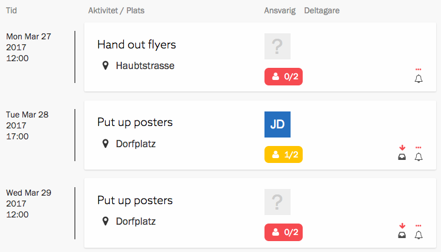
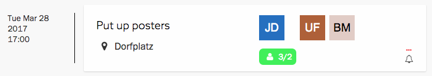
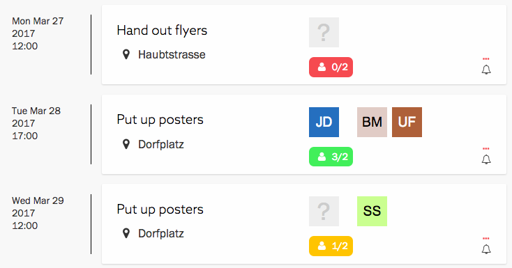
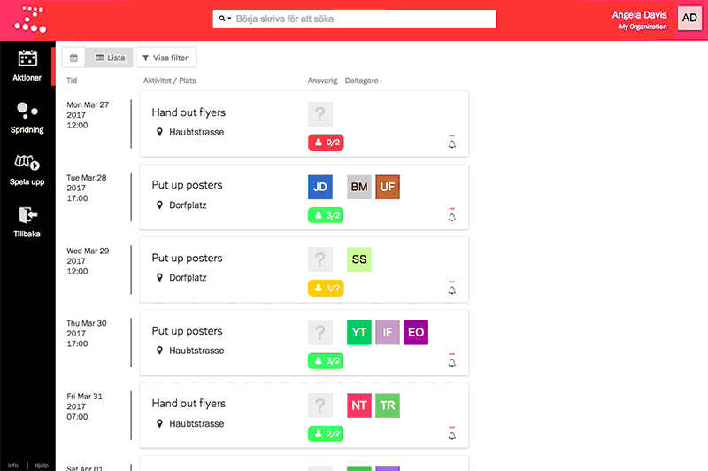
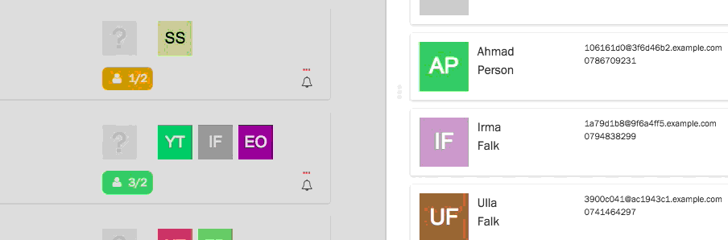
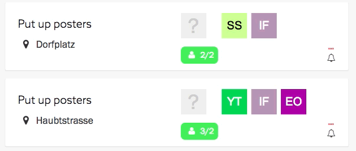
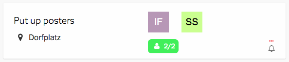
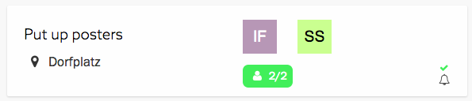

Den här guiden går igenom hur det löpande arbetet ser ut från dag till dag och
hur Zetkins funktioner kan användas för att arbeta så effektivt som möjligt så
att man kan genomföra större kampanjer med fler deltagare. Guiden är uppdelad
i fyra steg, som upprepas inför varje dag då det förekommer aktioner.

1. Boka in anmälda
2. Kontrollera och komplettera
3. Utse ansvariga
4. Skicka ut påminnelser

## Innan vi börjar
Denna guide handlar om _genomförandet_ av en kampanj, vilket förutsätter att vi
redan har planerat en kampanj, skapat aktioner som människor (eventuellt) har
anmält sig till, samt kanske genomfört någon form av mobiliseringsarbete.

Hur detta fungerar behandlas i guiderna [Planera en kampanj](../planera-en-kampanj)
och [Mobilisera med ringuppdrag](../mobilisera-med-ringuppdrag). Följ dessa
guider om du inte redan har kommit så långt att du har en kampanj där det är
dags att börja genomföra aktioner.

## Steg 1. Boka in anmälda
Löpande inför och under hela kampanjen behöver vi som organisatörer hantera de
anmälningar som kommer in och boka in de anmälda på aktioner. Aktivister kan ha
anmält sig manuellt via Zetkins aktivistportal, eller blivit anmälda av en
ringare över telefon och organisatörens uppgift är att godkänna varje anmälan
och göra om den till en bokning.

> Läs om skillnaden mellan anmälningar och bokningar i sektionerna
> [Kampanjens terminologi](../../kampanjer/grunderna) och
> [Anmälningar och bokningar](../../kampanjer/aktioner/bokningar).

Det gör vi enklast i aktionslistan, som vi hittar genom att gå in i sektionen
_Kampanjer_ i Organize, undersektionen _Aktioner_ och klicka på _Lista_ uppe
till vänster. Om vi har flera kampanjer igång samtidigt och bara är intresserade
av en av dem kan vi filtrera fram bara den kampanjen.

I aktionslistan ser vi statusen för varje aktion. En liten ikon som ser ut som
en inbox med en röd pil visas på de aktioner där det finns nya anmälningar,
d.v.s. aktivister som anmält sig men som ännu inte blivit inbokade.

Vi kan se att vår första aktion, den 27 mars, har det inte inkommit några
anmälningar till. Om den ligger i nära i tid är det inte osannolikt att vi helt
enkelt får ställa in den.

De efterföljande två dagarna, den 28 och 29 mars, finns det två aktioner där det
kommit in anmälningar. På aktionen den 28 mars har vi dessutom redan sedan
tidigare bokat in en ansvarig (JD).

Vi klickar på den första av de två aktionerna som öppnas i en ny panel där vi
kan se vilka de anmälda är. Genom att klicka på anmälningarna, eller klicka och
dra de anmälda till sektionen _Bokade deltagare_ bokar vi in dem på aktionen.

Efter att vi bokat in de båda anmälda deltagarna kan vi se i aktionslistan hur
statusen uppdateras och de nya bokningarna visas i listan. Ikonen som indikerar
anmälningar släcks eftersom alla anmälda nu blivit inbokade.

På det här sättet går vi igenom alla aktioner och bokar in de personer som
anmält sig. Målet är att alla aktioner ska bli gröna, d.v.s. att det ska finnas
tillräckligt med bokningar.

Det här arbetet kan vi göra kontinuerligt inför och under hela kampanjen. När vi
närmar oss en dag där det finns aktioner inbokade går vi vidare med de övriga
stegen i den här guiden.

## Steg 2. Kontrollera och komplettera bokningar
Inför en aktionsdag, förslagsvis en eller två dagar innan, kontrollerar vi
bokningsstatusen för alla den kommande dagens aktioner. Förhoppningen är att det
ska finnas tillräckligt många inbokade.

För varje aktion måste vi som organisatörer göra en avvägning baserat på
bokningsläget. Om det saknas många personer kanske vi väljer att ställa in, och
då måste vi kontakta alla de anmälda och informera dem om att det blir inställt.
Om det å andra sidan bara saknas en eller ett litet fåtal kanske vi kan lsöa det
genom att på egen hand hitta någon som kan hoppa in.

Som vi konstaterade nyss finns det inga anmälda till den första aktionen. Den
bestämmer vi oss för att ställa in. Eftersom ingen är anmäld är det ett enkelt
beslut – vi behöver inte kontakta någon eller göra något.

Vi ser i aktionslistan att nästa aktion är lugn – där finns det tre inbokade
och det krävs bara två. Dagen därpå saknas det dock en person.

Vi måste hitta någon att boka in den 29 mars för att vi inte ska tvingas ställa
in aktionen och gå miste om den inbokade Simon Saids engagemang. För att hitta
någon som snabbt kan hoppa in är det klokt att först vända sig till aktivister
som brukar ställa upp i kampanjarbete.

Vi har sedan tidigare en smart sökning som vi kallat för "Kampanjarbetare", som
inkluderar alla som någonsin har deltagit i en kampanj eller är inbokade på att
delta i en kampanj i framtiden. Jag kan öppna den smarta sökningens resultat
genom att söka efter dess namn.

I panelen som öppnas får vi en lista på alla personer som troligtvis kan tänka
sig att delta i kampanjarbete (baserat på att de gjort det förut eller anmält
sig till att göra det i framtiden). Vi kollar igenom listan efter personer som
vi känner igen och kan tänka oss att ringa till på studs.

Irma Falk är en sådan person. Vi ringer till henne på det nummer som visas i
listan och frågar om hon kan tänka sig att hoppa in. Det kan hon. Så vi klickar
och drar hennes bild till aktionen för att boka in henne.

Aktionens bokningsstatus ändras från gul till grön och vi har nu tillräckligt
många inbokade för att genomföra aktionen. Allt som saknas nu är en ansvarig.

## Steg 3. Utse ansvariga
För varje aktion vi ska genomföra måste vi utse en ansvarig.

> Att vara ansvarig för en aktion kan betyda olika saker i olika organisationer,
> och beroende på vad det är för aktivitet.

I vår organisation är det den som är aktionsansvarig som fixar fram material.
Den ansvarige förväntas också ha lite mer erfarenhet och kunskap så att andra
deltagare kan känna sig trygga med att de har någon att luta sig mot vid
aktionen.

Vi ser i aktionslistan huruvida en ansvarig har utsetts eller ej. På de flesta
av våra aktioner finns ingen ansvarig ännu, vilket indikeras med ett
frågetecken på den plats där den ansvarige visas.

Det är klokt att tillfråga den vi vill utse som ansvarig, så att de är beredda
på vad det innebär, vet att de ska hämta materialet i förväg och dylikt.

När vi pratade med Irma Falk i det föregående steget passade vi på att fråga om
hon kan tänka sig att vara ansvarig för de båda kommande aktionerna där hon
deltar. Det kunde hon. Vi sätter henne därför som ansvarig genom att klicka och
dra henne från deltagarlistan till ansvarsrutan.

Aktionerna är nu helt redo att genomföras. Det finns tillräckligt många bokade
och ansvariga har utsetts. Det sista vi gör inför aktionen är att skicka ut
påminnelser.

## Steg 4. Skicka ut påminnelser
Påminnelser skickas inte ut automatiskt, utan först när en funktionär manuellt
instruerar Zetkin att göra det, efter att vi är nöjda med bokningsläget, den
ansvarige o.s.v.

Hur långt i förväg som påminnelser ska skickas ut är därför helt och hållet upp
till oss som organisatörer. Praxis varierar från organisation till organisation,
och även mellan olika aktivteter. Vissa aktiviteter kan kräva mer förberedelse
från deltagarna och därför att påminnelserna kommer ut tidigare.

Vi väljer att skicka ut våra påminnelser en dag i förväg. En dag innan varje
aktionsdag går vi alltså in i aktionslistan och skickar påminnelser för de
aktioner som är planerade nästkommande dag.

> Om det kommit in fler anmälningar bokar vi in dem innan vi skickar
> påminnelser.

Huruvida påminnelser skickats till alla deltagare indikeras av den lilla
klockikonen nere till höger på varje aktion i aktionslistan. Om den är röd har
påminnelser inte gått iväg. Vi klickar på aktionen för att öppna aktionspanelen
och klickar där på _Skicka påminnelser_.

En ny panel öppnas med en lista på vilka påminneler som kommer att skickas. Om
vi redan skickat påminnelser en gång (men det tillkommit fler aktivister sedan
dess) kan vi också se vilka som redan fått påminnelser.

Vi klickar på knappen _Skicka_ för att påminnelserna ska gå iväg. Påminnelserna
skickas och listan i panelen uppdateras. Ikonen i aktionslistan förändras till
en grön bock.

Det är det sista vi behöver göra inför den här aktionen och vi är klara med
organiseringen för idag.

## Upprepa dag för dag
Dessa fyra steg upprepas sedan dagligen, eller åtminstone inför varje dag där
det förekommer aktioner. Om en kampanj är väldigt intensiv kan det ta en eller
ett par timmar per dag. I mindre intensiva kampanjer, exempelvis med en aktion i
veckan eller varannan vecka, behöver det inte ta mer än några minuter om dagen
(steg 1) och en liten stund extra dagen innan aktionen (steg 2-4).

## Sammanfattning
I den här guiden har vi gått igenom de steg som utgör det löpande
organiseringsarbetet under genomförandet av en kampanj. Vi har bokat in anmälda
och aktivister som vi själva kontaktat. Vi har utsett ansvariga och skickat iväg
aktionspåminnelser. Resten är upp till aktivisterna ute på stan.

* [Läs mer om kampanjaktioner](../../kampanjer/aktioner)
* [Läs mer om anmälningar och bokningar](../../kampanjer/aktioner/bokningar)
* [Läs mer om aktionspåminnelser](../../kampanjer/aktioner/paminnelser)
* [Läs guiden "Planera en kampanj"](../planera-en-kampanj)
* [Läs guiden "Mobilisera med ringuppdrag"](../mobilisera-med-ringuppdrag)
