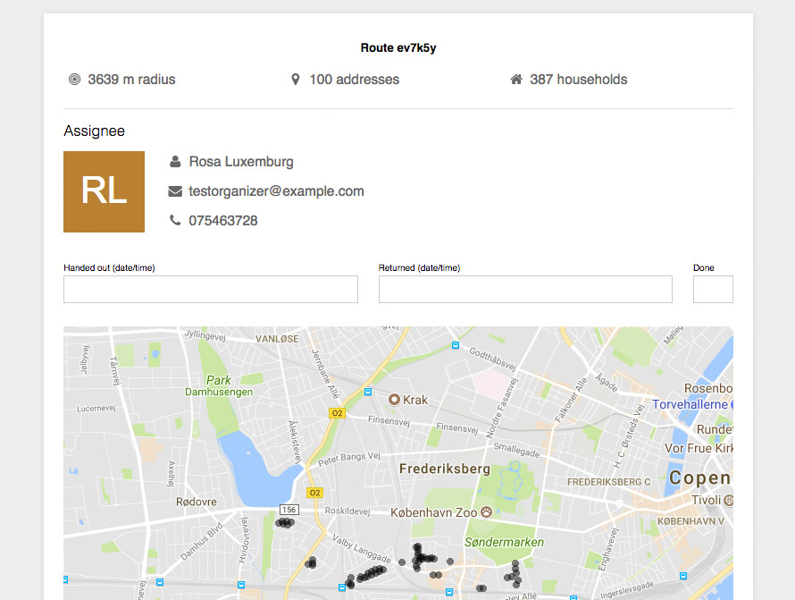

> Se guiden [Planera rutter](../planera-rutter) för att lära dig planera de
> rutter som används i denna guide.

I den här guiden skapar vi ett canvass-uppdrag för att dela ut tidningar till
hushåll, och använder de rutter som vi planerat sedan tidigare för att tilldela
områden som aktivister ska besöka. Guiden är uppdelad i tre steg:

1. Skapa ett uppdrag
2. Allokera rutter i uppdraget
3. Skriv ut och genomför rutt

## Innan vi börjar
För att kunna genomföra hushållsbesök ("canvassing") med Zetkin behöver vi ha
addresser och rutter. Adresserna måste laddas in av Zetkin Foundation, och
rutter planerar vi sedan själva i förväg. Detta beskrivs i detalj i den
[separata guiden](../planera-rutter) _Planera rutter för hushållsutdelning_.

När vi har ett antal rutter planerade är första steget inför varje ny kampanj
där vi besöker hushåll att skapa ett uppdrag.

## 1. Skapa ett utdelningsuppdrag
De rutter vi skapat går att använda gång på gång. Vissa organisationer genomför
bara denna typ av kampanjer vid val, andra gör det oftare än så.

För att vi ska kunna använda samma rutter mer än en gång avgränsar vi varje
användning i form av ett uppdrag, ungefär på samma sätt som man också kan
jobba med _ringuppdrag_ i Zetkin.

Det vi ska göra är att dela ut valtidningar i vår valrörelse, och därför skapar
vi ett uppdrag vars titel, datum och instruktioner är anpassade efter detta.

Under _Canvass_ i Zetkin Organize finns _Uppdrag_. Där klickar vi på _Skapa
uppdrag_ för att skapa ett nytt uppdrag, och kallar det "Valkampen 2017".

Efter att vi skapat uppdraget kan vi skriva instruktioner. Det kan exempelvis
vara en sammanfattning av hur man gör när man delar ut, tips om hur man kommer
in i låsta trappuppgångar, och dylikt.

Vi behöver bara ha ett uppdrag för vår kampanj, så vi är redo att gå vidare
och börja allokera rutter.

## 2. Allokera rutter i uppdraget
Bredvid knappen _Skapa uppdrag_ finns knappen _Tilldela rutt_. Vi klickar på
den för att allokera en av våra rutter i vårt nya uppdrag. När vi klickar på
knappen får vi först välja vilket uppdrag vi vill arbeta med. Vi väljer
uppdraget "Valkampen 2017".

> Listan innehåller bara sådana rutter som inte redan allokerats i det aktuella
> uppdraget.

Därefter får vi välja vilken av våra rutter vi vill använda. Vi väljer den
första, och klickar sedan på _Allokera den här rutten_. Rutten allokeras och
en panel öppnas med mer information.

Om vi vill kan vi nu utse en person som ska genomföra rutten, men vi kan också
välja att vänta med det, exempelvis om vi inte ännu vet vem som ska göra det.

Vi kan växla mellan _Uppdrag_ och _Tilldelade rutter_ genom vyväxlaren uppe
till vänster. Under _Tilldelade rutter_ finns en lista där vi hittar den rutt
vi just allokerat.

Om vi föredrar att allokera alla rutter i förväg kan vi gå vidare och göra på
samma sätt för var och en av de rutter vi vill genomföra i vårt uppdrag. Om vi
hellre allokerar rutter först när vi vet vem som ska genomföra dem kan vi stanna
här.

När det är dags för en aktivist att genomföra en rutt är nästa steg att skriva
ut den på ett papper som aktivisten kan bära med sig.

## 3. Skriv ut och genomför rutt
För att en aktivist ska veta vilka adresser som ska besökas skriver vi ut
information om rutten på papper. Utskriften innehåller en karta, en lista på
adresser, samt all information vi matat in om rutten och uppdraget, exempelvis
instruktionerna.

### Skriv ut
För att skriva ut en rutt måste den vara allokerad. I listan över _Tilldelade
rutter_ väljer vi en rutt. I panelen som öppnas finns länken _Skriv ut till
aktivist_. Genom att klicka där får vi upp en förhandsvisning av utskriften.

Kartan i förhandsvisningen är interaktiv. Om vi inte är nöjda med hur Zetkin
valt att beskära kartan så vi kan zooma och panorera runt.

Därefter använder vi vår webbläsarens vanliga utskriftsfunktion för att skriva
ut listan, och ger den till aktivisten som ska genomföra rutten. Vi noterar
datumet för när listan lämnades ut och ber också aktivisten skriva sitt namn,
telefonnummer och e-postadress (om vi inte redan gjort det innan vi skrev ut).

### Genomför och återrapportera
Aktivisten går sedan ut och delar ut tidningar till de hushåll som finns på
listan. Om man vill kan man bocka av varje adress man besöker, eller så väntar
man tills man är klar och bockar av i rutan _Klar_ på första sidan.
