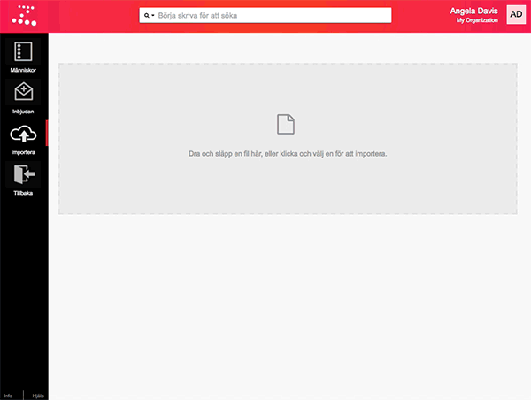
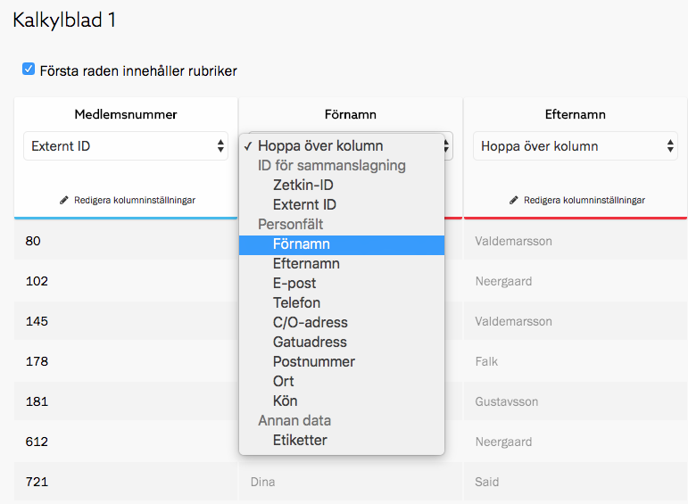
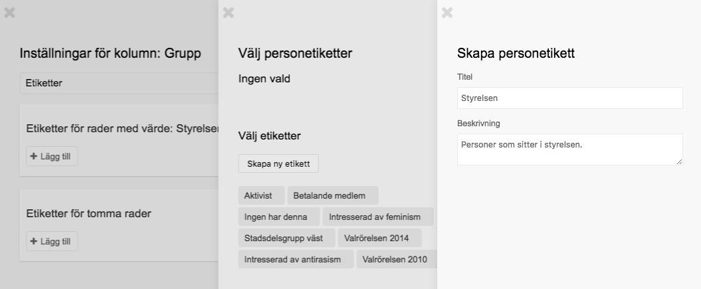
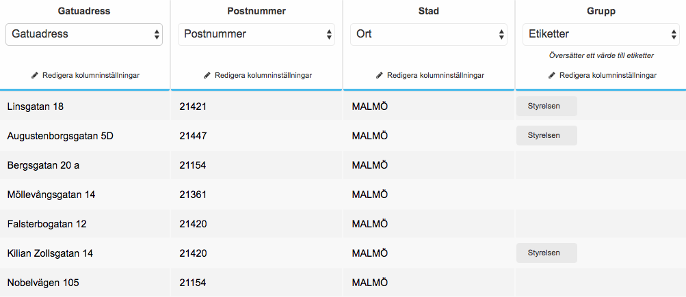

Denna guide går steg för steg igenom hur det kan gå till att importera personer
från en Excel-fil. Guiden är uppdelad i fyra steg:

1. Öppna filen i Zetkin Organize
2. Välj kolumner
3. Ställ in etiketter
4. Importera

> Man måste inte importera personer för att använda Zetkin. Aktivister kan
> själva ansluta sig till din organisation, anmäla sig till aktioner och dylikt,
> utan att först ha blivit importerade.

## Innan du börjar
För att importera personer till Zetkin behövs en Excel-fil där varje rad är en
person, och där de olika kolumnerna motsvarar olika attribut (exempelvis namn,
e-postadress och kön).

Du kan vanligtvis exportera ut en fil ur ditt befintliga system. Om du inte har
någon fil men vill följa med i guiden ändå kan du använda vår exempelfil.

[Ladda hem exempelfil.xls](./exempelfil.xls)

Exempelfilen har elva kolumner och innehåller 13 personer. Alla personer är
fiktiva, men filen är utformad för att likna befintliga system.

## Steg 1. Öppna filen i Zetkin Organize
Navigera till sektionen _Människor_ i Zetkin Organize, och välj _Importera_ i
menyn till vänster. Hit kan du dra och släppa Excel-filen för att öppna den.

> Du kan också klicka på den gråa ytan och leta upp din fil i dialogrutan som
> öppnas.

Filen öppnas och innehållet visas direkt i Zetkin Organize.

## Steg 2. Välj kolumner
Till att börja med är alla kolumner nedsläckta. Vi måste välja rätt
Zetkin-fält som varje kolumn ska importeras till. Det gör man i den lista
där det valda alternativet just nu är "Hoppa över kolumn". 

> _Externt ID_ är ett bra sätt att synka mellan Zetkin och ett annat system.
> Läs mer om [ID för sammanslagning](../../manniskor/importera#id-för-sammanslagning).

Den första kolumnen är speciell. Där finns ID-nummer från vårt medlemsregister,
som vi kommer fortsätta använda parallellt med Zetkin. Vi väljer därför att
importera denna kolumn som _Externt ID_, så kan vi göra fler importer från vårt
medlemsregister i framtiden med minimal risk för dubletter.

Gå sedan igenom följande kolumner och välj rätt fält för varje kolumn. Vi väntar
med kolumnen "Grupper".

> Du behöver inte importera all information om du inte vill. E-postadress och
> telefonnummer räcker bra för de flesta av Zetkins användningsområden.

* Förnamn
* Efternamn
* E-post
* Telefon
* C/O-adress
* Gatuadress
* Postnummer
* Ort
* Kön

## Steg 3. Ställ in etiketter
Den sista kolumnen, "Grupp" innehåller information om vilka grupper varje
person deltar i. Den enda grupp som förekommer i exempelfilen är "Styrelsen",
som fem personer är medlemmar i.

Ett smidigt sätt att spara den här informationen i Zetkin, för att kunna söka
och filtrera fram styrelsen, är att använda etiketter.

I kolumnhuvudet för kolumnen "Grupp", välj typen _Etiketter_. Klicka sedan på
_Redigera kolumninställningar_. I panelen som öppnas ska du välja vilka
etiketter som ska användas för de personer där det står "Styrelsen" i kolumen,
respektive de personer där kolumnen är tom.

Vi ska se till att alla personer som ingår i styrelsen får en etikett som heter
"Styrelsen". Klicka på _Välj etiketter_ i den översta rutan som gäller de rader
som har värdet "Styrelsen".

Om du inte redan har en sådan etikett måste du skapa den. Klicka på _Skapa
etikett_ och fyll i namnet och en beskrivning.

Spara den nya etiketten, välj den i panelen _Välj personetiketter_ och klicka
på knappen _Välj en etikett_ för att välja den. Stäng panelen med
kolumninställningar.

> Det går att ange flera etiketter för varje värde.

I tabellen kan du nu se etiketten "Styrelsen" på flera av personerna. På Vissa
av raderna finns en etikett, på andra rader ingen etikett.

## Steg 4. Importera
Importinställningarna är färdiga och tabellen ser bra. Allt du behöver göra nu
är att trycka på den blå knappen _Importera_ nere till höger.

Zetkin arbetar en liten stund och slutligen visas resultatet av importen. Om du
använt vår exempelfil bör du se att 13 personer importerats, att alla 13 har
skapats, ingen befintlig person har uppdaterats, och att fem av de importerade
personerna har fått någon etikett.

## Sammanfattning
I den här guiden har vi öppnat en Excel-fil i Zetkin Organize och gjort
inställningar för hur raderna i filen ska importeras till Zetkin. Vi har
importerat människor med flera olika fält, inklusive en etikett på de personer
som hade ett visst värde i en av kolumnerna i Excel-filen.

* [Läs mer om att importera människor](/sv/for-funktionarer/manniskor/importera/)
* [Läs om att söka med smarta sökningar](/sv/for-funktionarer/manniskor/smarta-sokningar/)
