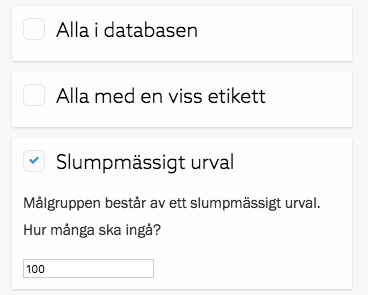
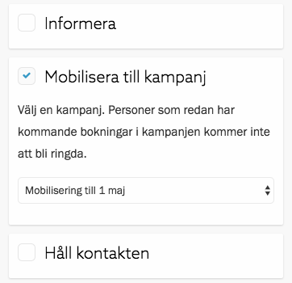
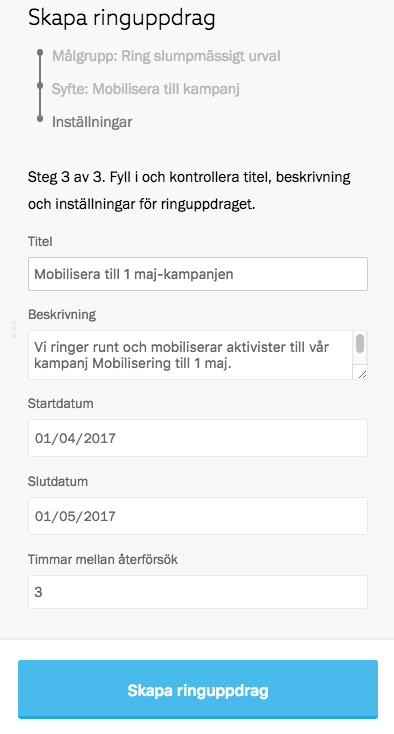
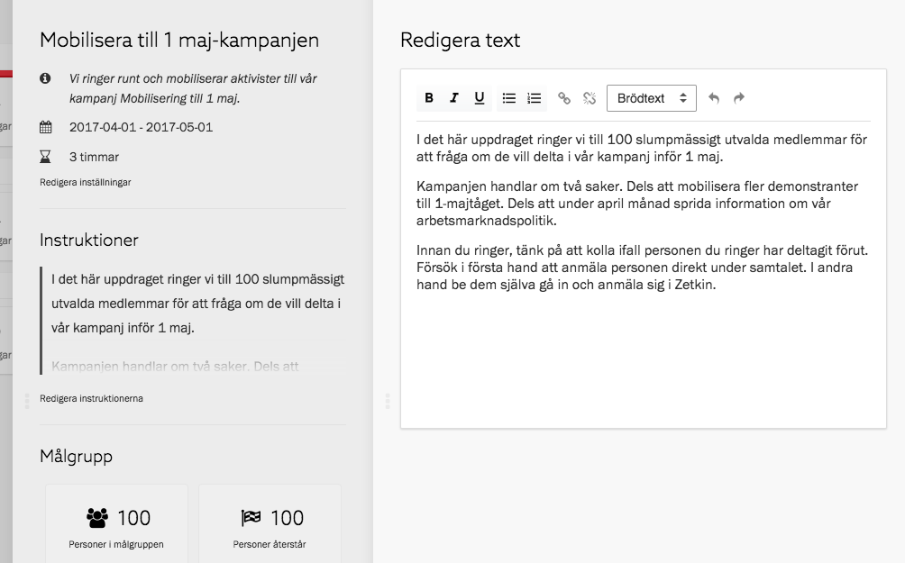
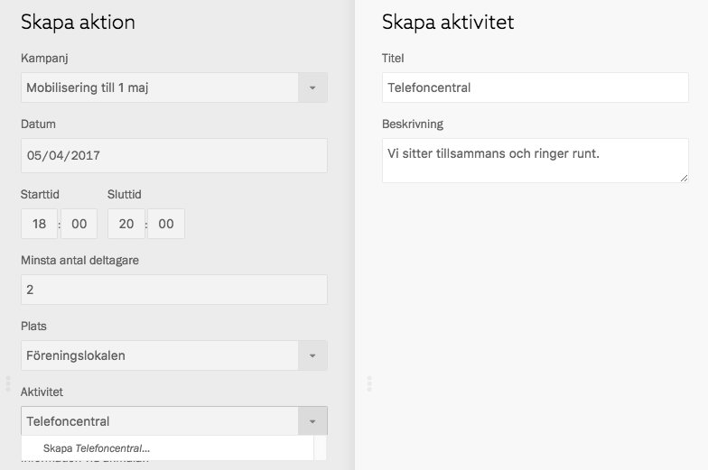
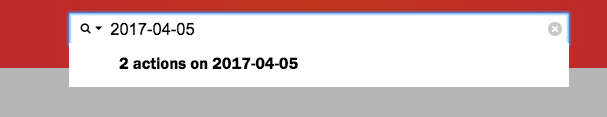
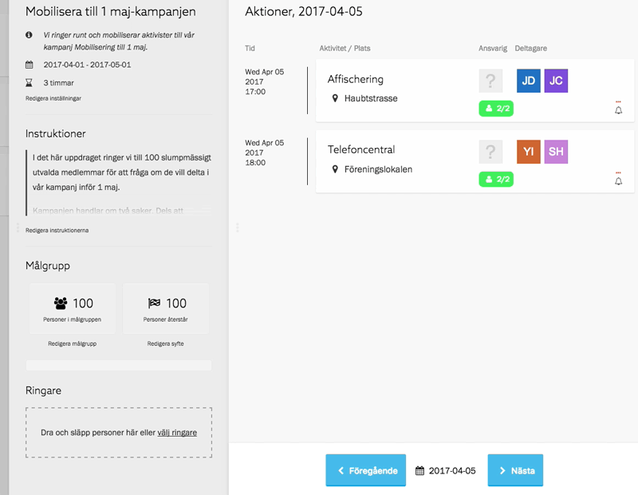
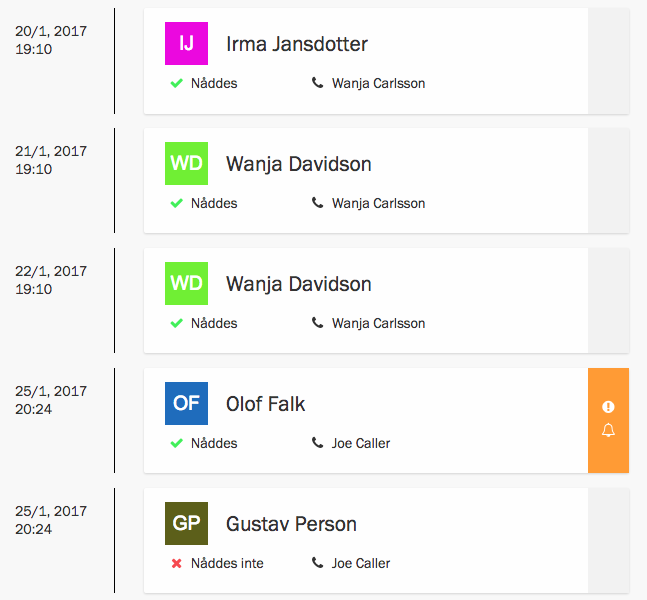
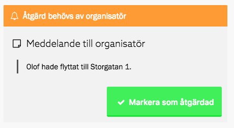

I den här guiden går vi igenom hur man skapar ett ringuppdrag för att mobilisera
till en kampanj. Vi går även igenom hur man kan organisera de rundringningar där
våra aktivister deltar. Guiden är uppdelad i tre steg:

1. Skapa ringuppdrag
2. Organisera rundringning
3. Följ upp

## Innan du börjar
Syftet med den här guiden är att skapa ett ringuppdrag för att mobilisera till
en befintlig kampanj. För att det ska finnas någon anledning att skapa ett
sådant här ringuppdrag, och för att det ska vara praktiskt möjligt att komma
igång på det sätt som guiden föreslår, måste det först finnas en kampanj.

Läs mer i [avsnittet om kampanjer](../../kampanjer) eller guiden
[Planera en kampanj](../planera-en-kampanj).

I den här guiden ska vi mobilisera till kampanjen "Mobilisering till 1 maj".

## Steg 1. Skapa ringuppdrag
Det mest centrala i en rundringning med Zetkin är det koncept som vi kallar för
[ringuppdrag](../../rundringningar/ringuppdrag). Ett ringuppdrag är när vi ger
en grupp i uppdrag att ringa en annan grupp.

Ringuppdrag skapar man i sektionen _Ringuppdrag_ i Zetkin Organize, genom att
klicka på knappen "Lägg till" och följa instruktionerna.

### Välj målgrupp och syfte
Först ska vi välja målgrupp. Vi kan välja mellan att låta målgruppen bestå av
alla i databasen, alla med en viss etikett eller ett slumpmässigt urval av alla.

Eftersom vi inte har hunnit sätta upp så många etiketter, men inte heller vill
ringa alla i hela databasen, väljer vi att målgruppen ska vara ett slumpmässigt
urval. Vi väljer att vi vill ringa 100 personer.

Vi klickar på den blå knappen i botten av panelen för att gå vidare till nästa
steg, där vi ska välja syftet med ringuppdraget.

> Bakom kulisserna blir målgruppen och syftet smarta sökningar. Läs mer om
> [hur målgrupp och syfte fungerar](../../rundringningar/ringuppdrag).

Vi ringer för att mobilisera till kampanjen "Mobilisering till 1 maj" och
väljer därför den i listan över kampanjer.

Vi har nu valt ringuppdragets målgrupp och syfte. Vi klickar på den blåa knappen
i botten av panelen för att gå vidare.

### Beskriv uppdraget
I sista steget får vi fylla i inställningar för ringuppdraget. Eftersom vi
använt oss av Zetkins mallar är namn och beskrivning redan ifyllda. Vi ändrar
namnet för att det ska bli lite snyggare, samt justerar datumen så att de
stämmer överens med när vi vill genomföra kampanjen.

Därefter klickar vi på knappen _Skapa ringuppdrag_ för att slutföra. Uppdraget
skapas och en ny panel öppnas med det färdiga uppdraget.

I den nya panelen kan vi bland annat redigera instruktioner till ringare. Precis
när vi skapat ringuppdraget är instruktionerna tomma, men vi kan skriva nya.

Vi klickar på _Redigera instruktioner_ och skriver en liten text som förklarar
för ringare vad uppdraget handlar om, vilka vi ringer till och vad vi vill att
ringaren ska göra under samtalet.

När vi skapat ett ringuppdrag och skrivit instruktioner är vi färdiga med
förberedelserna. Nu är det dags att börja rekrytera ringare och organisera
själva ringandet.

## Steg 2. Organisera rundringningar
Rundringningar kan genomföras på många olika sätt. Man kan ha massvis med
ringare som delar på arbetet, eller en låta en enda person göra allt. Man kan
sitta tillsammans på bestämda tider, eller utspridda på olika platser och vid
olika tillfällen.

Många tycker det är trevligt att ringa tillsammans. Då kan man ge varandra tips,
peppa varandra efter tråkiga samtal, och ta raster tillsammans. Dessutom blir
det en häftig stämning när man är många som ringer tillsammans.

För vår mobilisering ska vi genomföra gemensamma ringtillfällen. Vi har ett par
personer som har lovat att ringa på onsdagkvällar, men vi vill också låta fler
komma med om de vill. Därför ska vi skapa aktioner för ringtillfällen så att vem
som helst kan anmäla sig.

### Aktioner för ringtillfällen
Vi skapar en ny aktivitet som vi kallar "Telefoncentral" och lägger till tre
aktioner med denna aktivitet i vår 1 maj-kampanj.

> Läs mer om att [skapa aktioner](../../kampanjer/aktioner/skapa-och-redigera)
> eller guiden [Planera en kampanj](../planera-en-kampanj).

På så sätt kan alla som anmäler sig till flygbladsutdelningar och andra aktioner
i kampanjen också lätt anmäla sig till telefoncentralerna.

### Lägg till deltagare som ringare
Inför varje tillfälle kontrollerar vi vilka som anmält sig. För att de ska kunna
vara med och ringa måste vi lägga till dem som ringare i uppdraget. Det gör vi
genom att öppna ringuppdragspanelen på nytt. Långt ner i panelen finns sektionen
_Ringare_.

Med ringpanelen uppe söker vi efter dagens datum. Zetkin känner igen att det är
ett datum och att det finns två aktioner på det aktuella datumet.

> Om en person redan är tillagd som ringare behöver du inte lägga til dem igen.

Om vi öppnar sökresultatet genom att klicka på det öppnas en panel med en lista
på dagens aktioner, däribland vår telefoncentral. Vi kan se att två personer är
inbokade. För att lägga till dessa som ringare behöver vi bara dra och släppa
dem till sektionen _Ringare_ i ringuppdragspanelen.

> Du kan prioritera och exkludera etiketter för enskilda ringare. Läs mer om att
> [anpassa ringares målgrupper](../../rundringningar/ringare/#anpassa-ringares-mlgrupper)

Om du vill kan du ändra inställningar för ringaren, exempelvis för att påverka
vilka personer ur målgruppen som ringaren ska ringa i första hand. Vi väljer att
inte göra några sådana inställningar för våra ringare, och oftast klarar man sig
bra utan det.

### Genomföra ett ringpass
För att genomföra ett ringpass behövs vissa förberedelser. Man måste se till att
all teknik som behövs finns – datorer och telefoner. Dessutom är det bra att
inleda ett ringpass med att ge alla ringare en introduktion. Dels till tekniken,
och då inte minst [hur man ringer med Zetkin](/sv/for-aktivister/ringa-med-zetkin),
men också till själva ringuppdraget.

Vi har planerat att ett ringpass är två timmar. De första 15 minuterna går den
som är ansvarig för passet igenom allt med eventuella nya ringare.

## Steg 3. Följ upp
Efter ett ringpass, eller efter hela kampanjen är avslutad, behöver vi som
organisatörer följa upp det som hänt under rundringningarna. Dels för att bilda
oss en uppfattning om hur ringandet gått, men framförallt för att vidta
eventuella åtgärder.

I samtalsloggen i Zetkin Organize kan vi hitta samtal där ringare rapporterat
att åtgärd krävs från organisatör. Sådana samtal är markerade med orange och en
klocka i högerkanten.

Vi kan klicka på samtalet i loggen för att läsa det meddelande som ringaren
skrivit. Vi kan se att under samtalet med Olof Falk fick ringaren reda på att
Olof flyttat till ny adress.

> Så länge det finns flaggade samtal kommer mottagaren inte att bli ringd igen.
> När vi markerar som åtgärdad släpps den spärren.

Vi uppdaterar Olofs adressinformation i vårt medlemsregister, och klickar sedan
på knappen _Markera som åtgärdad_ för att signalera för systemet, oss själva
och framtida ringare att det problem som dök upp under samtalet nu är löst.

## Sammanfattning
I den här guiden har vi skapat ett ringuppdrag för att mobilisera till vår
1 maj-kampanj. Vi har skapat aktioner för gemensamma ringtillfällen och lagt
till deltagarna som ringare. Vi har gått igenom hur man kan organisera ett
ringpass, och hur man följer upp rundringningarna i samtalsloggen.

* [Läs mer om rundringningar](../../rundringningar)
* [Läs guiden "Planera en kampanj"](../planera-en-kampanj)
* [Läs guiden "Genomför en kampanj"](../genomfor-en-kampanj)
