Den här guiden går igenom hur Zetkins verktyg kan användas för att lösa den här
uppgiften. Guiden är uppdelad i tre steg:

1. Skapa kampanjen och aktioner
2. Analysera och korrigera
3. Kontrollera kampanj

## Innan du börjar: kampanjidén
Det första steget innan det överhuvudtaget blir dags att använda Zetkin är att
utforma en kampanjidé. Vad är syftet med kampanjen? Vad finns det för politiskt
och praktiskt innehåll, såsom material, politiska krav och dylikt?

Zetkins kampanjverktyg används sedan för att planera och organisera utåtriktat
kampanjarbete där många aktivister deltar, exempelvis flygbladsutdelningar,
demonstrationer, gatufester och dylikt. Det är detta som avses med en
[kampanj](/sv/for-funktionarer/kampanjer/grunderna) i Zetkin, även om termen
kampanj kan ha en mycket bredare betydelse.

I den här guiden ska vi planera en kampanj som handlar om att mobilisera till
en demonstration på 1 maj. Mobiliseringsarbetet går ut på att sprida information
i staden genom flygbladsutdelning och affischering.

En lämplig intensitetsnivå för vår fiktiva organisation är i genomsnitt en
aktion per dag, och kampanjen ska börja två veckor innan 1 maj. Vi vill synas i
alla stadsdelar, och täcka in alla våra sparade platser åtminstone en gång, med
extra fokus i centrum.

Den här typen av beslut fattar vi i vår kampanjgrupp eller styrelse utan hälp
av Zetkin. Det är först när vi kommit fram till dessa grundförutsättningar som
det är dags att vända sig till Zetkins verktyg för att skapa kampanjen.

## Steg 1. Skapa kampanj och aktioner
I _Kampanj_-sektionen i Zetkin Organize finns aktionskalendern. Här sker det
mesta arbetet när vi planerar en kampanj. Det är här vi skapar kampanjens
aktioner.

> Läs mer om hur man skapar aktioner i avsnittet
> [Skapa och redigera aktioner](../../kampanjer/aktioner/skapa-och-redigera).

### Första aktionen
Vi klickar på plus-knappen på den 17 april, alltså två veckor innan 1 maj. Här
ska vi skapa den första aktionen. I panelen _Skapa aktion_ måste vi först välja
kampanj, men vår 1 maj-kampanj finns inte ännu.

Vi skriver "Mobilisering till 1 maj" i kampanjfältet och väljer alternativet
_Skapa Mobilisering till 1 maj_. En ny panel öppnas där vi kan redigera namnet
och skriva en beskrivning av kampanjen. Vi klickar "Spara" och stänger panelen.
Tillbaka i panelen _Skapa aktion_ kan vi nu välja den nya kampanjen.

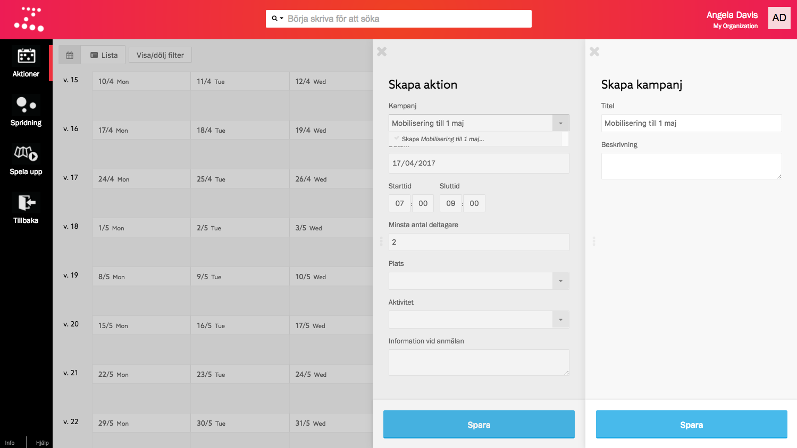

Härnäst väljer vi tid, plats och aktivitet. Om detta är den första kampanjen vi
planerar och vi inte har skapat några platser i förväg får vi upprepa processen
med att skapa nya platser och nya aktiviteter precis som vi skapade en ny
kampanj. 

> Läs mer om att [skapa nya platser](../../kartor-och-platser/plaster) i förväg.

Vi väljer att aktionen ska äga rum kl 7-9 på morgonen på "Hauptstrasse", en av
platserna i vår fiktiva organisation och att det ska vara en
"Flygbladsutdelning".

Vi sparar aktionen och stänger panelen, och därmed har vi planerat den första
aktionen i vår kampanj.

### Preliminärplan över intensitet
Härefter upprepar vi stegen för att skapa fler aktioner: Skapar en ny aktion på
nästa dag, väljer vår kampanj i listan (vi behöver inte skapa någon ny igen),
en ny tid, plats och aktivitet.

Steg för steg skapar vi fler och fler aktioner. Vi försöker att ha i åtanke
att sprida aktionerna över olika tider på dagen, olika platser och aktiviteter,
men detta är en preliminärplanering som vi snart ska justera.

Istället fokuserar vi just nu på att få en bra intensitet över tid, alltså
antalet aktioner per dag. I aktionskalendern ser vi enkelt om vi har noll, en
eller två aktioner per dag och kan justera genom att dra och släppa från en dag
till en annan.

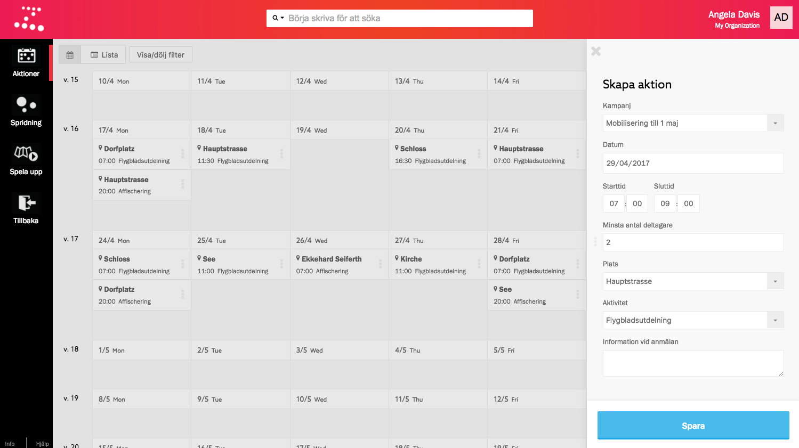

När vi har en grund är det dags att börja analysera aktionerna i vår preliminära
plan och justera så att vi får rätt spridning mellan olika tider, platser och
aktivitter.

## Steg 2. Analysera och justera
Mycket av analysen sker i den undersektion som heter _Spridning_. Vi börjar med
att filtrera på vår 1 maj-kampanj så vi analyserar rätt aktioner. Vi klickar på
_Visa filter_ och väljer kampanjen i listan.

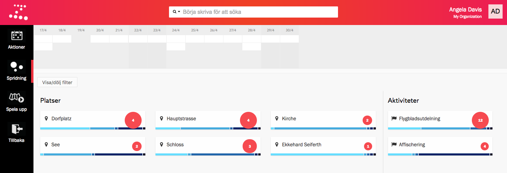

Här gör vi en första bedömning av spridningen i vår preliminära plan. Vi kan vår
stad, vår organisation, våra aktivister, vilka dagar i veckan och tider på dagen
som olika platser och aktiviteter fungerar. Här är de frågor vi vill ha svar på:

* Har vi en bra fördelning mellan olika platser och aktiviteter?
* Affischerar vi vid rätt tider? Affischering gör vi helst på kvällar och
  affischer måste komma upp tidigt i kampanjen.
* Är vi vid kyrkan på rätt dagar? Söndagar kring 11-13 är bästa tiden.
* Dorfplatz är en pendelstation. Är vi där vid rätt tider på dygnet?
* Täcker vi upp alla tider på dygnet med flygbladsutdelning?

### Fördelning av platser och aktiviteter
En första blick över distributionsvyn gör tydligt att vi har en ganska jämn
fördelning mellan olika platser med viss övervikt på platserna "Dorfplatz" och
"Hauptstrasse". Det är bra, eftersom de är platser som många rör sig på. Även
fördelningen med betydligt fler flygbladsutdelningar än affischeringar är bra.

Vi konstaterar att det är onödigt att vara tre gånger på "Schloss" och bara en
på "Ekkehard Seiferth". För att jämna ut fördelningen vill vi flytta en av
flygbladsutdelningarna.

När vi för musen över "Schloss" lyser de tre aktionerna upp i mini-kalendern
överst i vyn.

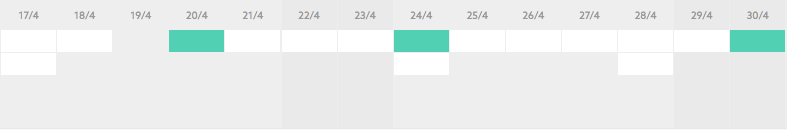

Vi vill flytta den sista aktionen, söndagen den 30/4. Vi kan klicka på aktionen
på plats i mini-kalendern, och håller ner `alt` när vi klickar för att komma
direkt till panelen _Redigera aktion_. Vi ändrar platsen och sparar aktionen.
Distributionsdiagrammen upppdateras omedelbart med den nya fördelningen.

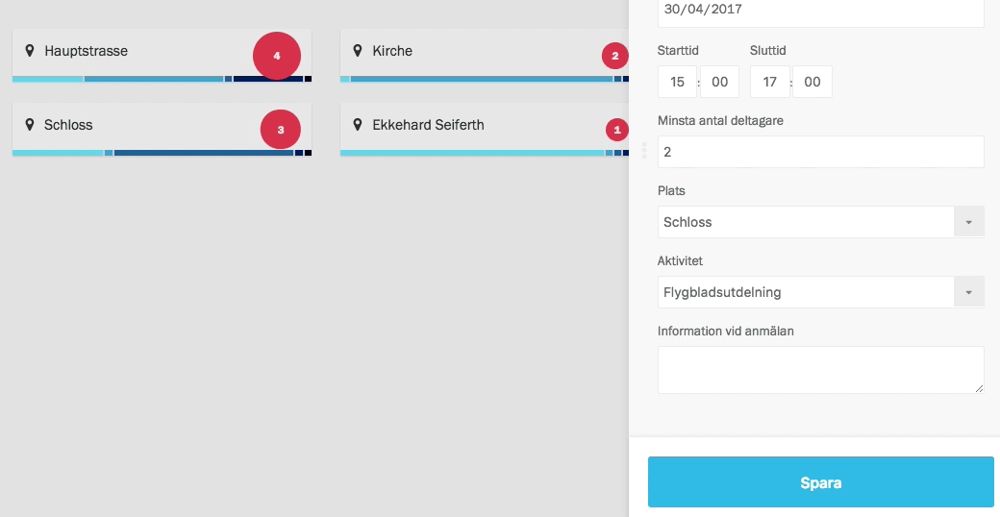

Med den lilla ändringen är vi nöjda med fördelning mellan platser och
aktiviteter.

### Affischering rätt tider
Härnäst ska vi kontrollera att de affischeringar vi tagit med i den preliminära
planen ligger vid rätt tider, i veckan såväl som på dygnet.

Precis som vi gjorde nyss med "Schloss" för vi musen över "Affischering" för att
se vilka datum affischeringspassen är inplanerade. Spridningen över olika dagar
ser helt ok ut, men på kortet för affischering kan vi också se fördelningen över
olika tider på dygnet.

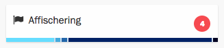

> Läs mer om vad de olika färgerna i staplarna motsvarar för tider på dygnet i
> avsnittet [Analysera kampanj](../../kampanjer/analysera#mellan-tider-p-dygnet).

I stapeldiagrammet i kortets nederkant ser vi att det förekommer affischeringar
på morgonen (ljusblå stapel) och kvällen (mörkblå stapel). Affischering vill vi
bara ha på kvällar. Vi kan föra muspekaren över den ljusblå stapeln för att se
i mini-kalendern vilken av aktionerna som är en morgonaffischering.

Vi alt-klickar på den aktion som lyser upp i mini-kalendern. Vi kan välja att
byta tid till kvällen, eller så kan vi helt enkelt välja att göra om aktionen
till en flygbladsutdelning. Det ligger tre affischeringar ganska tätt, så vi
väljer att byta den aktuella morgonaktionen till flygbladsutdelning.

Spridningsdiagrammet visar nu en affischering mindre, och i stapeldiagrammet
ser vi att morgonpasset inte finns kvar.

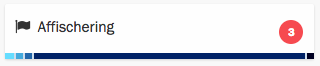

Efter ändringen ser vår plan över affischeringar bra ut.

### Rätt tider utanför kyrkan
Vissa platser fungerar bäst på speciella tider. I vår fiktiva organisations
stad finns en kyrka där människor främst rör sig på söndagförmiddagar.
Självklart är det då vi ska vara där och dela ut flygblad.

Vi för muspekaren över platsen "Kirche" och ser att en av aktionerna ligger på
en fredag i den preliminära planen. Att det är en fredag kan vi avgöra eftersom
lördagar och söndagar i mini-kalendern har en något mörkare bakgrundsfärg.

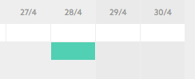

Vi vill flytta aktionen till en söndag. Det kan vi göra genom att öppna panelen
_Redigera aktion_ som tidigare, men vi kan också enkelt flytta från en dag till
en annan genom att dra och släppa den.

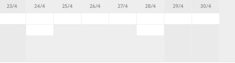

Efter flytten kan vi för säkerhets skull föra musen över "Kirche" igen och få
bekräftat att båda aktionerna nu ligger på en söndag. Dessutom ser vi med hjälp
av stapeldiagrammet att alla "Kirche"-aktioner är på förmiddagar, så vi kan
vara nöjda.

### Rusningstrafik på Dorfplatz
På samma sätt är vissa platser ungefär lika aktiva varje dag i veckan, men
varierar kraftigt mellan olika tider på dygnet. En sådan är "Dorfplatz" som är
en pendelhållplats i vår fiktiva organisations stad.

När vi kollar på stapeldiagrammet på fördelning över dygnet ser vi att en
fjärdedel av alla aktioner äger rum på förmiddagen, och en fjärdedel på
eftermiddagen (innan 17). Det vore bättre om dessa aktioner istället låg
tidigare på morgonen eller senare på kvällen.

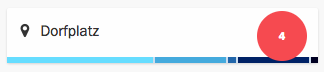

Nu har vi fått in rutinen och löser det här på samma sätt som vi gjort med
platser, dagar och aktiviteter. Vi för muspekaren först över ena stapeln,
alt-klickar aktionen som lyser upp, och ändrar tiderna till 17-19. När vi
gör samma sak med den andra aktionen märker vi att det är en affischering.
Affischeringar ska ligga sent på kvällen, så vi låter den vara.

Efter ändringarna har vi endast aktioner på Dorfplatz på morgonen och efter
17.00, så som är lämpligt vid en pendlingshållplats i vår stad.

### Flygbladsutdelning alla tider
Slutligen vill vi kontrollera att vi nu har flygbladsutdelningar relativt
jämnt fördelade över olika tider på dygnet. I stapeldiagrammet för
"Flygbladsutdelning" ser vi att vi saknar utdelningar på kvällen (efter 17).

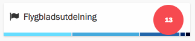

Vi vill gärna få in åtminstone någon flygbladsutdelning där vi kan nå de
människor som rör sig på stan under kvällen.

Vi kommer fram till att en bra plats att vara på under kvällstid är utanför
slottet ("Schloss") på fredagkvällar. Vi kan nu välja att flytta någon aktion,
men vi kan också välja att helt enkelt skapa en ny.

Fredagen i veckans första kampanj ligger i nuläget bara en aktion, vilket syns
tydligt i mini-kalendern. När vi för musen över dagen i kalendern kommer en
plus-knapp fram. Om vi klickar på knappen öppnas panelen _Skapa aktion_.

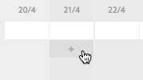

Det är samma panel som vi använde när vi skapade aktioner i den stora kalendern.
Eftersom vi filtrerat på vår kampanj är den redan förvald. Även dag är ifylld.
Vi fyller i tiden 20-22, väljer "Schloss" som plats och "Flygbladsutdelning" som
aktivitet.

Efter ändringen ser fördelningen mellan olika tider på dygnet bättre ut. Nu
finns det åtminstone en flygbladsutdelning sent på kvällen, och vi kan vara
nöjda med spridningen på våra planerade aktioner.

## Steg 3. Kontrollera kampanj
Vi har fått en bra inblick i hur våra aktioner är spridda mellan olika platser
och aktiviteter, men det som inte är uppenbart i spridningsvyn är huruvida alla
platser på en viss plats äger rum i slutet av kampanjen, i början, eller är väl
distribuerade över hela kampanjen. Vi kan så klart se det när vi håller musen
över en viss plats, men det kan vara krångligt att göra med många platser, och
dessutom är platser i vår stad inte isolerade öar utan hänger ihop i större
områden och stadsdelar.

För att få en bättre uppfattning om vår planerade kampanjs geografi finns
verktyget _Spela upp kampanj_. Vi klickar på _Spela upp_ i sektionsmenyn till
vänster.

I verktyget finns minikalendern tillsammans med en karta över det område där
vår kampanj utspelar sig. Vi trycker på play och kan se hur hela kampanjen
spelas upp, med aktioner som lyser upp på kartan i takt med att de inträffar.

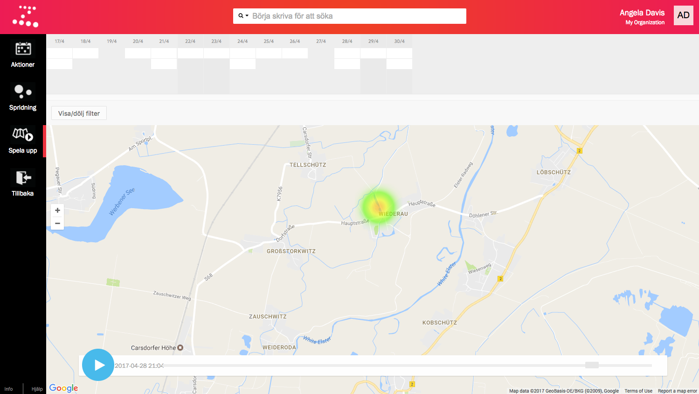

Aktionerna hoppar fram och tillbaka på kartan. Det är ett gott tecken, för det
betyder att den geografiska spridningen ser bra ut över tid. Vi kan vara nöjda
med vår kampanjplan.

## Sammanfattning
I den här guiden har vi planerat en kampanj och fyllt den med aktioner. Vi
började med en preliminärplan som vi skapade i aktionskalendern. Därefter
använde vi spridningsvyn för att utvärdera och justera kampanjen tills vi var
nöjda med spridningen mellan platser och aktiviteter. Slutligen kontrollerade
vi kampanjen genom att spela upp den.

Nu är det bara att sätta igång och mobilisera till kampanjen och genomföra den.

* [Läs mer om kampanjer](../../kampanjer)
* [Läs mer om kampanjaktioner](../../kampanjer/aktioner)
* [Läs mer om att analysera kampanjer](../../kampanjer/analysera)
* [Läs guiden "Mobilisera med ringuppdrag"](../mobilisera-med-ringuppdrag)
* [Läs guiden "Genomför en kampanj"](../genomfor-en-kampanj)
