I den här guiden planerar vi rutter för ett canvass-uppdrag där vi ska dela ut
tidningar till hushåll. Vi resonerar oss fram till bästa sättet att lägga upp
rutterna, och använder Zetkins verktyg på olika sätt för att kunna arbeta så
effektivt som möjligt.

## Innan vi börjar
För att kunna planera rutter behöver det finnas adresser i din organisations
databas. Gå in på sektionen _Rutter_ under _Canvass_ i _Zetkin Organize_ så
laddas adresser in. När de laddats färdigt visas alla adresser på en karta.

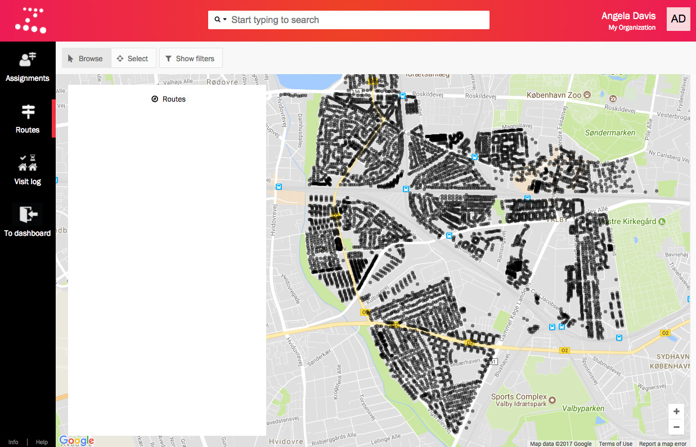

Om du ser kartan med adresserna är det fritt fram att jobba vidare.

### Om ni saknar adresser
Ifall din organisation saknar adresser kommer du att se ett meddelande om
att kontakta Zetkin Foundation. Om ni har möjlighet att skapa eller på annat
sätt ta fram en lista på adresser i ert område kan Zetkin Foundation hjälpa
er att lägga in dem för användning i Zetkin.

## Hur ska rutterna användas?
Innan vi börjar skapa rutter behöver vi fundera över lite principer för
rutterna. Dessa varierar från organisation till organisation, och från uppgift
till uppgift.

Vi ska använda rutterna för att dela ut tidningar till hushåll. Att dela ut
tidningar går snabbt (jämfört med att exempelvis knacka dörr) så rutterna kan
vara stora. Å andra sidan är tidningar tunga att bära runt på så rutterna kan
inte innehålla alltför många hushåll eller ha alltför stora avstånd.

Vid hushållsutdelning går en stor andel av tiden åt till att färdas mellan
adresser, jämfört med exempelvis dörrknackning där större delen av tiden
istället läggs vid varje dörr. Vid utdelning blir därför skillnaden mellan
en rutt med många hushåll per adress och enstaka hushåll per adress extra
markant.

Utifrån dessa resonemang bestämmer vi oss för följande principer:

* Rutter bör innehålla omkring 300-400 hushåll
* Det är bra att undvika rutter med endast villor och andra hus med endast
  ett hushåll
* Avstånden inom en rutt bör inte vara mer än en kilometer

Det är utifrån dessa principer som vi nu ska gå vidare och skapa rutter,
och vi använder Zetkins gränssnitt för att rätta oss efter dem.

## Steg 1. Bekanta dig med gränssnittet
Sektionen _Rutter_ under _Canvass_ består huvudsakligen av en karta, full
med svarta prickar som motsvarar adresser.

### Kartan och adresser
Vi kan zooma i kartan genom att klicka på plus- och minus-knapparna nere
i högra hörnet, eller genom att använda scrollfunktionen på vår mus eller
trackpad. Vi kan panorera i kartan genom att klicka och dra.

Om vi klickar på en adresspunkt i kartan öppnas information om adressen i en
separat panel. Där finns bland annat information om adressens position på
kartan och antal hushåll samt möjlighet att sätta etiketter på adressen.

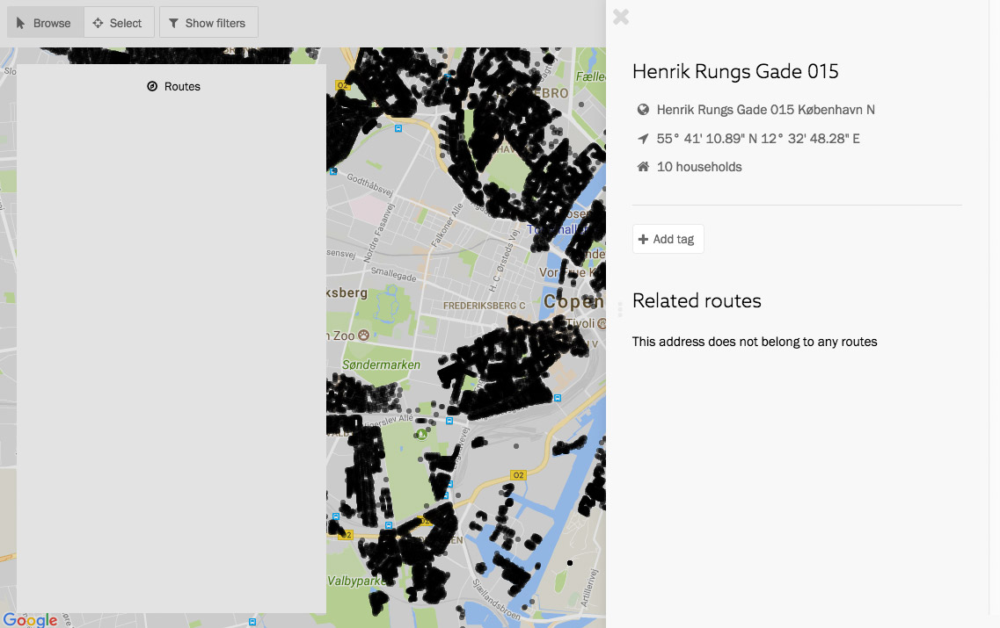

Vi ser också att adressen inte ingår i några rutter. Det är rimligt, för
som vi kan se i den tomma ruttpanelen till vänster i kartan har vi inga rutter 
ännu.

## Steg 2. Välj adresser för en rutt
Uppe till vänster finns knappar för att växla mellan två arbetslägen. Ett
för att navigera i kartan och ett för att välja en eller flera adresser,
exempelvis för att skapa rutter.

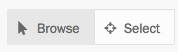

### Välj en eller flera addresser åt gången

Vi väljer läget _Välj_ (_Select_). I det här läget kan vi inte längre
öppna en adresspanel genom att klicka på en svart prick. Om vi klickar på
en adress markeras den istället och ingår nu i vårt urval.

> Om vi vill ta bort en adress ur urvalet kan vi klicka på den igen.

Om vi klickar på fler adresser läggs de till i urvalet. Urvalet markeras i
kartan med blåa prickar istället för svarta. En sammanfattning av urvalet
visas i en ny panel som öppnas automatiskt nere till vänster.

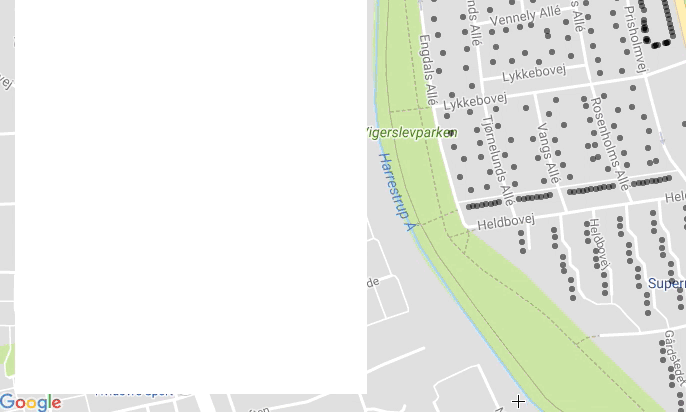

I panelen ser vi antalet valda adresser, såväl som det totala antalet hushåll
på dessa adresser, och storleken på området som adresserna utgör.

Vi vill ha ca 300 hushåll i våra rutter, så vi behöver välja fler adresser
innan vi går vidare och skapar vår första rutt.

Vi behöver inte klicka på alla. När arbetsläget är _Välj_ kan vi klicka och
dra med musen för att välja flera adresser inom ett rektangulärt område.

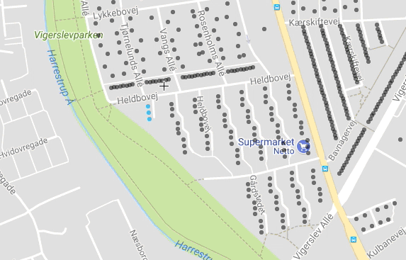

Om vi vill använda samma funktion för att ta bort adresser ur vårt urval
kan vi hålla inne alt-knappen på tangentbordet samtidigt som vi klickar och
drar med musen. Vi kan också ta bort adresser ur urvalet en och en genom
att klicka på dem.

## Steg 3. Skapa rutt med adresserna
Vi håller hela tiden koll på sammanfattningen nere till vänster. Vi lägger
till och tar bort ur urvalet med de funktioner vi precis utforskat tills vi
är nöjda med storleken på urvalet. Därefter klickar vi på knappen _Lägg till
i rutt_ (_Add to route_).

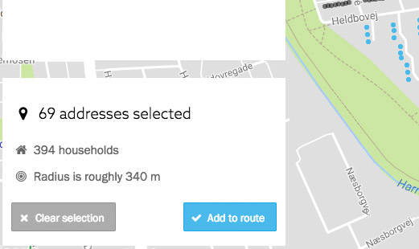

När vi klickar på knappen öppnas en ny panel. Panelen sammanfattar än en gång
urvalet och låter oss antingen skapa en ny rutt med de valda adresserna, eller
utöka en befintlig rutt. Vi har inga rutter ännu, så att utöka en befintlig
rutt är inte möjligt just nu.

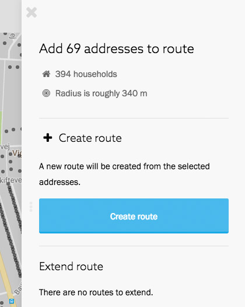

Vi klickar på knappen _Skapa rutt_ (_Create route_). En ny rutt skapas och
öppnas i samma panel. Rutten dyker också upp i listan till vänster på kartan.
Om vi håller musen över ruttens namn i listan till vänster lyser de relevanta
adresserna upp i rött på kartan.

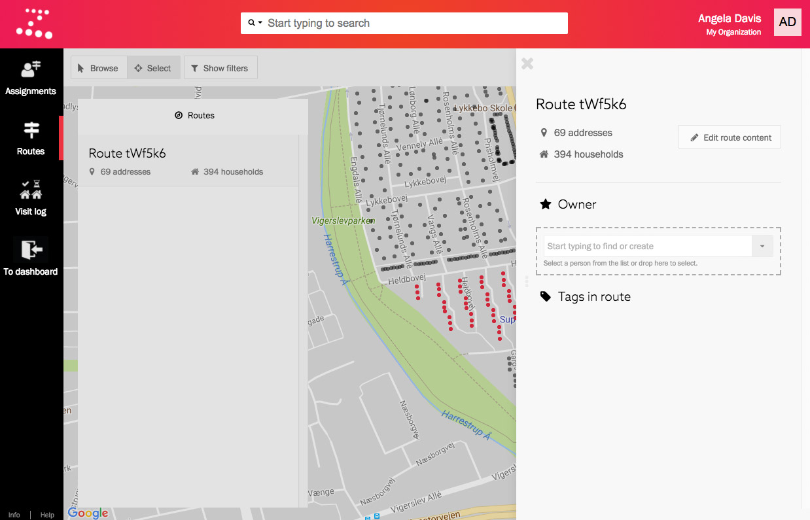

Vår första rutt är skapad. Vi kan stänga ruttpanelen till höger för tillfället.
Vi behöver den inte för att gå vidare och skapa nästa rutt.

## Steg 4. Skapa fler rutter
Nästa steg är att skapa en till rutt. Vi ska fortsätta jobba på samma sätt,
d.v.s. välj adresser vi vill ska ingå i rutten, håll koll på urvalets storlek,
och skapa rutt när urvalet är lagom stort.

### Dölj "färdiga" adresser
Vi vill undvika att välja samma adresser en gång till. För att underlätta kan
vi använda filtreringen i kartan. Uppe till vänster finns som vanligt en knapp
som heter _Visa filter_ (_Show filters_).

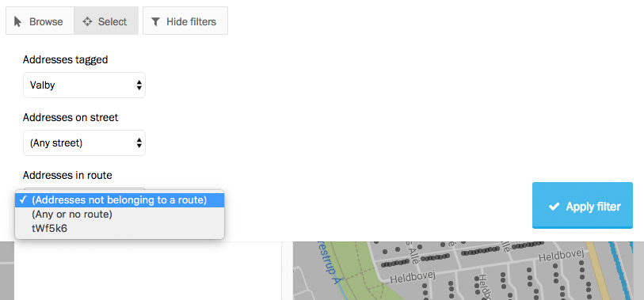

Här kan vi bland annat filtrera adresser baserat på vilken rutt de tillhör,
eller bara visa de adresser som inte tillhör någon rutt alls. Om vi väljer
det alternativet och tillämpar filtret döljs de adresser vi nyss lade till
i en rutt.

Vi upprepar därefter steg 3 gång på gång för att skapa fler rutter.

### Lägg till adresser till rutt
Ibland är det smidigare att välja adresser utifrån vilken gata de ligger på,
istället för att försöka markera rätt adresser inom en rektangel.

Efter att vi skapat några rutter inser vi att en är lite för liten. Den
innehåller bara hundra adresser och lika många hushåll.

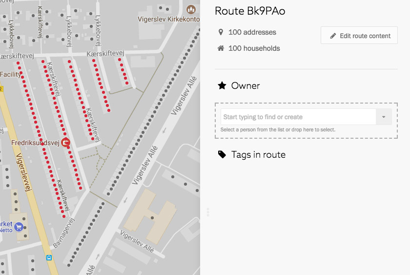

Vi kan redigera innehållet i adressen utan att behöva jobba i kartan. Om vi
klickar på knappen _Redigera ruttens innehåll_ (_Edit route content_) får vi
upp en ny panel med en lista på alla adresser som ingår i rutten. Vi kan ta
bort adresser ur rutten, men vi kan också lägga till rutter.

Vi vill lägga till adresserna på den diagonala gatan "Vigerslev Allé". Det är
en väldigt lång gata och vi vill inte lägga till alla adresser, utan bara dem
som befinner sig nära vår rutt, nummer 180-300.

Det kan vi göra genom att söka i fältet i panelen efter "Vigerslev". En lista
på adresser på den aktuella gatan visas. Vi kan välja en specifik adress för
att lägga till den, men eftersom vi vill lägga till flera adresser väljer vi
alternativet "Vigerslev Allé" (utan gatunummer).

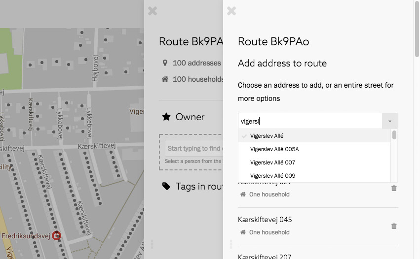

En lista på alla adresser på den aktuella gatan öppnas i en ny panel. Här kan
vi välja vilka adresser vi vill lägga till. Vi kan också filtrera om vi bara
vill se udda eller jämna nummer.

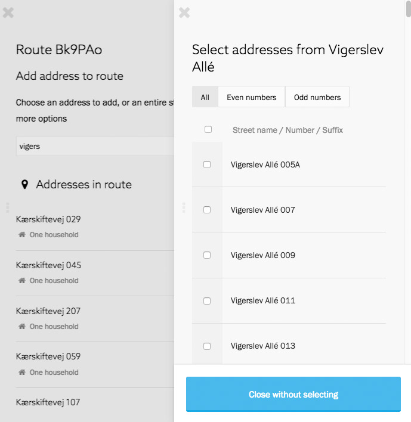

Vi scrollar ner i panelen tills vi kommer till nummer 180 och väljer den. Vi
scrollar sedan hela vägen ned till nummer 300. Samtidigt som vi håller nere
shift-knappen på vårt tangentbord väljer vi nummer 300. Nummer 300 väljs,
och alla andra nummer mellan 180 och 300 också.

Vi slutför valet genom att klicka på knappen _Välj 59 adresser_ (_Select 59
addresses_).

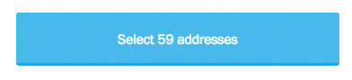

Panelen stängs och adresserna läggs till i rutten. Ruttpanelen uppdateras i
bakgrunden med nya siffror. Rutten innehåller nu 159 adresser och lika många
hushåll.

## Steg 5. Slutför alla adresser
Vi fortsätter att upprepa steg 3 och 4 för att skapa rutter med alla adresser.
Tack vare filtret kan vi kontrollera att alla adresser blir tillagda i en rutt.

Vi aktiverar filtret och visar endast adresser som inte ingår i en rutt. Är
kartan helt tom? Då är vi klara!

## Sammanfattning
I den här guiden har vi gått igenom hur man skapar rutter för utdelning,
dörrknackning eller dylikt. Vi har resonerat kring hur stor en rutt bör vara,
och utformat rutter såväl genom att välja adresser på kartan och genom att lägga
till adresser/gator separat i efterhand.
