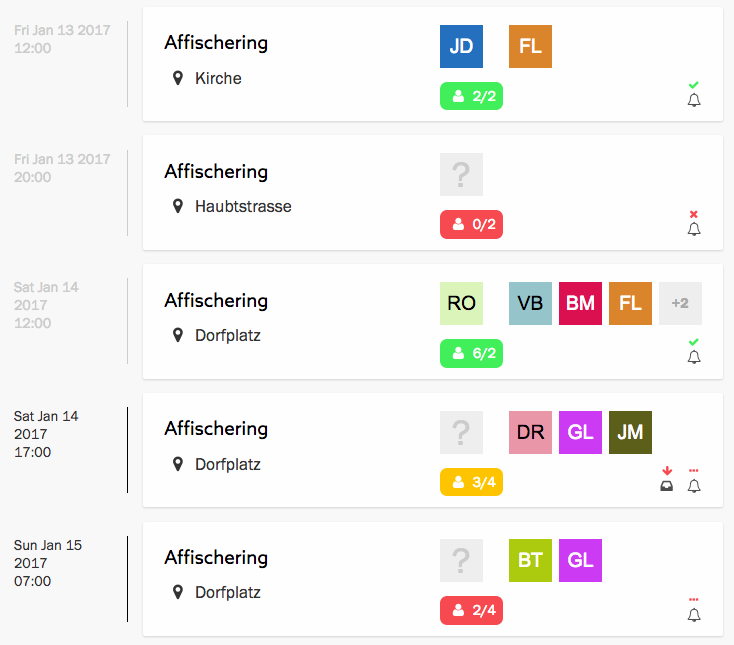
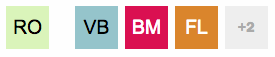
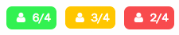
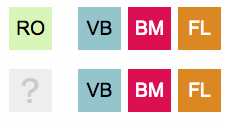
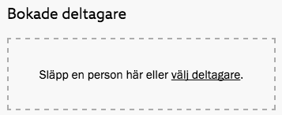
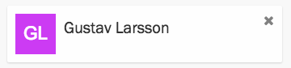

Efter att en aktivist anmält sig, via aktivistportalen eller via en ringare i
en rundringning, måste hen bokas in på aktionen. Funktionärer kan också boka
in aktivister som inte själva anmält sig via Zetkin, exempelvis därför att man
fått veta på annat sätt att aktivisten vill delta.

## Anmälningar och bokningar i aktionslistan
En aktions status avseende anmälningar och bokningar indikeras på olika sätt i
[aktionslistan](../#organisera-med-aktionslistan), för att den som det dagliga
arbetet under en kampanjs genomförande snabbt ska kunna få en överblick över
kommande aktioner.

> Lär dig vad de olika ikonerna i aktionslistan betyder. Då kommer du snabbt
> och enkelt kunna sköta det dagliga organiseringsarbetet i en kampanj.

### Bokningsstatus och deltagare
Till vänster i aktionslistan visas datum, aktivitet och plats för aktionen.
Precis till höger om denna information finns en sammanfattning av de som
är bokade på aktionen.

Dels kan du se de personer som är inbokade i form av deras avatarer. Om du
håller musen över en avatar visas personens namn. Om det finns fler bokningar än
vad som kan visas direkt i listan indikeras antalet med en siffra sist i listan.

Bilden illustrerar en aktion med sex inbokade deltagare. De första fyra visas
med sin avatar, och siffran "+2" indikerar att det finns ytterligare två
deltagare inbokade.

> Inställningen _Minsta antal deltagare_ ändrar du när du [skapar eller
> redigerar en aktion](../skapa-och-redigera).

Under deltagarlistan finns en indikator som visar huruvida det är tillräckligt
många inbokade. Där visas antalet bokningar samt aktionens värde på
inställningen _Minsta antal deltagare_. Indikatorn kan vara röd, gul eller
grön beroende på hur många som är inbokade jämfört med vad som angivits som
minsta antal deltagare.

När du scrollar genom listan för att bedöma hur bokningsläget ser ut kan du
alltså hålla utkik efter gula och röda aktioner. Hit behöver ni mobilisera
lite extra.

### Aktionsansvarig
Den lucka som ligger något avskilt längst till vänster i deltagarlistan den som
är aktionsansvarig. Om ingen har utsetts till ansvarig innehåller luckan ett
frågetecken.

En ansvarig måste utses innan påminnelser kan skickas iväg. När du scannar
av listan bör du alltså hålla utkik efter tomma luckor i kolumnen för
kontaktpersoner.

### Nya anmälningar
Om det finns nya anmälningar till en aktion så indikeras det med en liten ikon
nere till höger i aktionslistan.

Det är klokt att hålla utkik efter nya anmälningar löpande, men det viktigaste
är att boka in alla anmälda innan påminnelserna skickas ut.

## Boka in nya deltagare
Det är först när en aktivist är inbokad som hen räknas som en deltagare, vilket
betyder att hen får påminnelseutskick, räknas med i statistiken etc. Läs mer om
skillnaden mellan [anmälan](../../grunderna#anmlan) och [bokning](../../grunderna#bokning)
i kapitlet _Kampanjens terminologi_.

### Boka in anmälda
Om en aktion har nya anmälningar (som inte redan bokats in) indikeras detta i
aktionslistan. Klicka på aktionen för att öppna upp aktionspanelen.

Överst i aktionspanelen finns avsnittet _Anmälningar_. Den bör vara tom, men
om det kommit in anmälningar som inte bokats in ligger de här. Längre ner i
samma panel finns avsnittet _Bokade deltagare_.

Klicka på en anmälan, eller klicka och dra den, för att flytta den till _Bokade
deltagare_ och därigenom boka in personen på aktionen.

### Boka in andra
För att boka in personer som inte själva har anmält sig måste du leta upp dem
i persondatabasen. Det kan du göra på flera olika sätt.

I aktionspanelen, som du kommer till genom att klicka på en aktion i kalendern
eller aktionslistan, finns avsnittet _Bokade deltagare_. Här kan du klicka på
_välj deltagare_ och leta upp rätt person i den panel som öppnas.

Du kan också söka fram personen på vilket annat sätt som helst, exempelvis med
[Zetkins sökfunktion](/sv/for-funktionarer/zetkin-organize/sok/), och sedan
klicka och dra personens avatarbild till den streckade ytan under _Bokade
deltagare_.

Slutligen kan du göra precis samma sak, d.v.s. leta fram en person och klicka
och dra deras avatarbild, men släppa den direkt på aktionen i aktionslistan
istället.

## Utse aktionsansvarig
Du kan utse en ansvarig genom att klicka på aktionen och välja i panelen som
öppnas, eller genom att dra och släppa en deltagare till luckan för
aktionansvarig.

## Avboka deltagare
Om du vill avboka en deltagare från en aktion gör du det i aktionspanelen som
du öppnar genom att klicka på aktionen i kalendern eller aktionslistan. I
panelens avsnitt _Bokade deltagare_ finns alla som är bokade. Leta upp rätt
person där och klicka på det lilla krysset.

