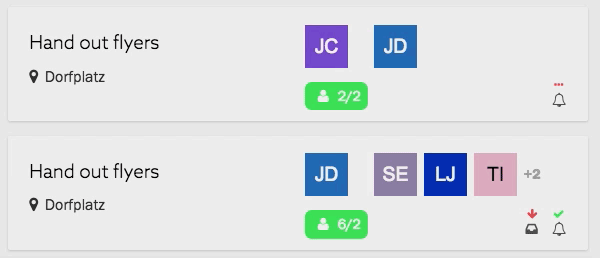
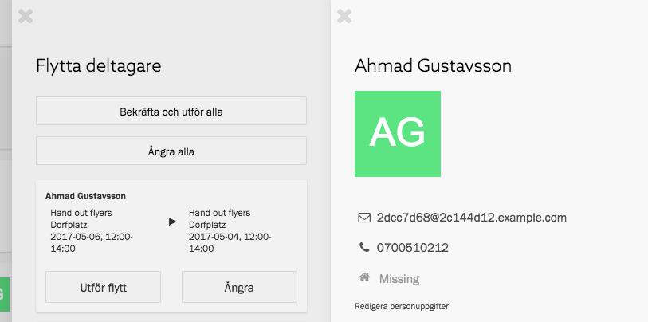

Anledningarna är många till att det kan vara nödvändigt att flytta deltagare.
Kanske är det alldeles för många som anmält sig till en viss aktion. Kanske
är det bättre att ha en viss person på en annan plats än den anmälda.

När du vill flytta deltagare måste du oftast stämma av det med den du flyttar.
Men det kan vara svårt att ställa frågan innan du vet hur du vill ha det. Med
Zetkins flyttverktyg kan du pussla färdigt innan du skickar iväg frågorna.

## Flytta deltagare mellan aktioner
Det enklaste sättet att flytta en deltagare är genom att dra och släppa dem
i aktionslistan.

När du flyttar en deltagare öppnas en panel som heter _Flytta deltagare_. I
panelen ser du en beskrivning av flytten. Om du gör fler förflyttningar
dyker de också upp i listan. Om du flyttar samma person två gånger innebär
det bara en flytt. Om du flyttar tillbaka personen till den ursprungliga
aktionen innebär det ingen flytt alls.

I panelen ser du tydligt vilka som blir det slutgiltiga förflyttningarna under
tiden som du pusslar. Flytten är inte genomförd ännu, utan du måste klicka på
_Utför flytt_ (eller _Bekräfta och utför alla_) för att genomföra den.

## Stäm av och utför
När du är nöjd med pusslet behöver du antagligen stämma av med personerns så
att de tycker det är ok att ha blivit flyttad. I panelen _Flytta deltagare_
kan du klicka på en person för att få upp personpanelen med kontaktuppgifter.

Ring personen, kontrollera att flytten är ok, och om de är nöjda klicka på
knappen _Utför flytt_ för att verkställa förflyttningen.

På det här viset hjälper Zetkin dig hålla alla förflyttningar i huvudet och
sedan bekräfta dem innan de slutgiltigt utförs.
