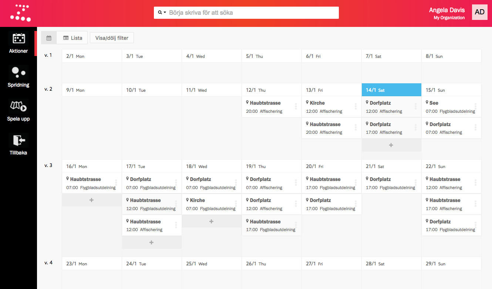
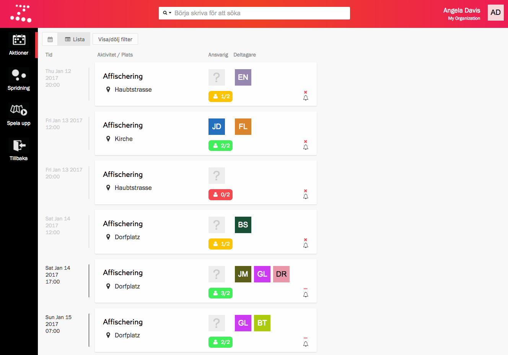
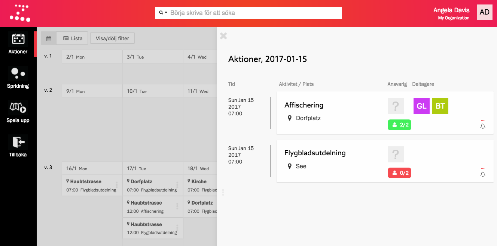

Hur du arbetar med aktioner beror mycket på din organisations verksamhet. En
aktion kan vara en flygbladsutdelning eller en flashmob, en banderollverkstad
eller ett bullbak, en kaférunda eller ett pass i en informationsdisk.

Det som är gemensamt för alla aktioner är just att de är en enkel aktivitet
på en viss plats vid en viss tid, samt att en aktion alltid tillhör en kampanj.

## Aktiviteter och platser
En aktion är en viss _aktivitet_ på en viss _plats_. I Zetkin lagrar din
organisation en databas av olika aktiviteter och platser, som du kan återanvända
när du skapar aktioner.

Det är viktigt att återanvända aktiviteter och platser istället för att skapa
kopior för att Zetkins filtreringar, sökningar och statistik ska fungera som
förväntat.

## Skapa och redigera aktioner
Du skapar aktioner i aktionskalendern i Zetkin Organize. När du skapar en
aktion anger du vilken kampanj den tillhör (eller påbörjar en ny kampanj),
vilken aktivitet det rör sig om samt var och när aktionen äger rum.

Du kan flytta och på andra sätt redigera aktioner efter att de skapats.

[Läs om att skapa och redigera aktioner](./skapa-och-redigera)

## Olika vyer för olika uppgifter
I Zetkin Organize får du överblick över aktioner på två olika sätt – i
aktionskalendern respektive aktionslistan. En lista över aktioner en viss dag
finns dessutom i dagspanelen. De olika vyerna lämpar sig olika bra beroende på
vad du jobbar med.

### Planera med aktionskalendern
Aktionskalendern lämpar sig bra för att planera kampanjer och få överblick
över många aktioner på en gång. I kalendern kan du enkelt se hur en kampanj
skiftar i intensitet över tid.

Från aktionskalendern kan du antingen öppna en enskild aktion genom att klicka
på den, eller en hel dags aktioner i en separat dagspanel genom att klicka på
dagens datum.

### Organisera med aktionslistan
Med aktionslistan får du mer information om varje aktion direkt i överblicken.
Utöver tid, plats och aktivitet ser du också hur många (och vilka) som är
inbokade, vem som är utsedd till ansvarig och aktionens status.

> Kom ihåg att det är skillnad på anmälan och bokning. Läs mer om
> [kampanjens terminologi](../grunderna/#anmlan).

I aktionslistan avgör du enkelt om du behöver hitta fler deltagare innan
aktionen kan genomföras, huruvida det finns fler anmälda som du ännu inte
bokat in och om påminnelser skickats ut till alla deltagare eller ej.

När du lärt dig vad aktionslistans olika ikoner betyder blir den ett oumbärligt
verktyg i det löpande organiseringsarbetet. Scrolla snabbt genom listan varje
dag för att bedöma vad som behöver göras inför de kommande aktionerna.

### Fokusera med dagspanelen
Dagspanelen innehåller en aktionslista som avgränsats för en specifik dag. På
så sätt kan du lätt zooma in och fokusera på en dag i taget, exempelvis inför
morgondagen.

Du hittar till dagspanelen genom att klicka på ett datum i aktionskalendern
eller genom att söka efter ett visst datum.

## Genomföra aktioner
Aktioner genomförs av aktivister ute på stan. Men av dig som organisatör krävs
också lite löpande arbete inför genomförandet av varje aktion. Det handlar
oftast om fyra uppgifter:

* Boka in personer som anmält sig till aktionen.
* Eventuellt hitta fler aktivister för att slippa ställa in aktionen
  om det är en eller flera för få anmälda.
* Utse en av deltagarna till ansvarig (och stäm av med personen).
* Skicka ut påminnelser till alla deltagare.

Läs mer i de separata sektionerna om att [boka in deltagare, utse ansvarig](./bokningar)
och att [skicka ut påminnelser](./paminnelser).
