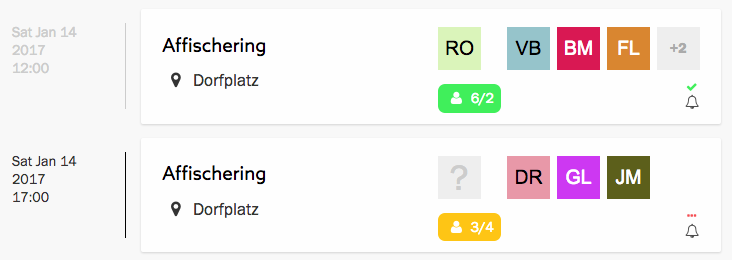
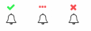

En aktionspåminnelse är ett e-postmeddelande som Zetkin skickar, men först efter
att du som funktionär manuellt sagt åt Zetkin att göra det.

Påminnelsen innehåller information om aktionen, såsom tid, plats och aktivitet.
Den innehåller också kontaktuppgifter till den person som utsetts till ansvarig
för aktionen.

Den aktionsansvarige får en separat påminnelse som utöver information om
aktionens tid, plats o.s.v. också innehåller kontaktuppgifter till alla
deltagare.

## Påminnelser i aktionslistan
I aktionslistan kan du se huruvida påminnelser har skickats ut till alla
deltagare genom en liten ikon nere i högra hörnet.

Ikonen indikerar huruvida påminnelser har skickats (grön bock), kan skickas
(röda prickar) eller inte längre kan skickas (rött kryss). Om påminnelser inte
kan skickas beror det på att aktionens datum redan har passerat.

> Det är upp till dig och din organisation att bestämma hur tidigt i förväg
> som påminnelser ska skickas.

Ikonerna anger hurivida _alla påminnelser_ skickats. Ibland bokas en person in
på en aktion efter det att påminnelserna skickats iväg, och denne har då inte
fått någon påminnelse. Ikonen återgår då till att indikera att påminnelser inte
har skickats, och en funktionär måste skicka påminnelser på nytt.

När du scannar av aktionslistan i det dagliga organiseringsarbetet, håll
utkik efter röda prickar som indikerar att en påminnelse ännu inte skickats.

## Skicka påminnelser
Som funktionär måste du säga åt Zetkin att skicka påminnelser. Det gör du med
ett enkelt knapptryck – själva utformandet och skickandet av påminnelserna
sköter Zetkin automatiskt.

Du skickar påminnelser från aktionspanelen, som du öppnar genom att klicka på
en aktion i kalendern eller aktionslistan. I panelen finns en knapp som heter
_Skicka påminnelser_, som öppnar en separat panel.

I panelen _Skicka påminnelser_ ser du vilka deltagare som redan fått en
påminnelse och när. Här kan du också skicka till dem som inte fått.

När du skickar påminnelser går de endast till deltagare som inte redan fått
en påminnelse. Undantaget är den som är aktionsansvarig, som får en ny
påminnelse med uppdaterad information om vilka som deltar.
