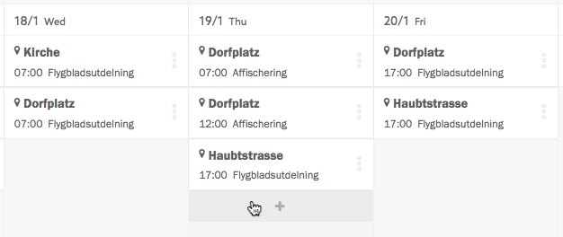
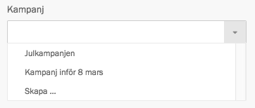
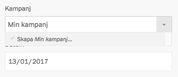
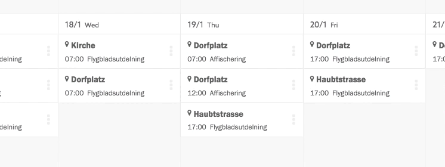

## Skapa aktion

Det enklaste sättet att skapa en ny aktion är att klicka på plus-knappen på
en viss dag i aktionskalendern.

När du klickar på plus-knappen öppnas panelen _Skapa aktion_. Här måste du
fylla i vilken kampanj aktionen tillhör, var och när den äger rum, samt vilken
aktivitet det rör sig om.

I panelen _Skapa aktion_ anger du också minsta antal deltagare, alltså hur många
aktivister som krävs för att aktionen ska kunna genomföras på ett bra sätt. Den
här siffran använder Zetkin för att indikera aktionens status, exempelvis i
[aktionslistan](../#organisera-med-aktionslistan).

Du kan också skriva fritextinformation som visas vid anmälan, exempelvis om du
vill uppmärksamma aktivister på vad aktionen handlar om eller någon annan form
av information som är viktig i samband med anmälan.

### Välja kampanj, aktivitet och plats

Kampanj, aktivitet och plats kan du inte bara skriva in, utan måste väljas från
den databas som din organisation har i Zetkin över kampanjer, aktiviteter och
platser.

> Läs mer om [kampanj](../../grunderna#kampanj), [aktivitet](../../grunderna#aktivitet)
> och [plats](../../grunderna#plats) i _Kampanjens terminologi_.

När du markerar ett av fälten _Kampanj_, _Plats_ och _Aktivitet_ öppnas en
lista över befintliga val. Du kan börja skriva namnet på den kampanj, plats
eller aktivitet du söker för att filtrera listan.

Om listan är tom, eller det val du vill välja inte finns kan du skapa en ny
kampanj, plats respektive aktivitet.

> Tänk på att inte skapa dubletter. Om alternativet du söker redan finns i
> listan ska du inte skapa något nytt.

För att skapa en ny kampanj, skriv namnet på kampanjen i _Kampanj_-fältet,
exempelvis "Min kampanj", och välj alternativet "Skapa Min kampanj". En ny panel
öppnas där du kan komplettera med mer information om kampanjen och spara den.

På samma sätt kan du skapa nya platser och kampanjer direkt genom listan.

## Redigera aktioner
> Om du klickar på en aktion öppnas en sammanfattning. Om du istället vill öppna
> redigeringen direkt, håll inne `alt` när du klickar på aktionen.

Du kan redigera de flesta aspekter av en aktion i efterhand. När du klickar på
en aktion i kalendern eller i aktionslistan öppnas en sammanfattning av
aktionen, inklusive information om deltagare, anmälningar, kontaktperson och
annat som är relevant under tiden som en kampanj genomförs. Klicka på länken
_Redigera aktion_ för att ändra inställningar såsom datum och tid, aktivitet
och plats, m.m.

## Flytta aktioner i kalendern
> Var försiktig med att flytta aktioner som aktivister börjat anmäla sig till.

Om du vill byta datum på en aktion kan du också göra det genom att klicka och
dra den direkt i kalendern.

Att snabbt och enkelt kunna flytta en aktion från en dag till en annan på det
här sättet är smidigt inte minst under planeringen av en kampanj.
