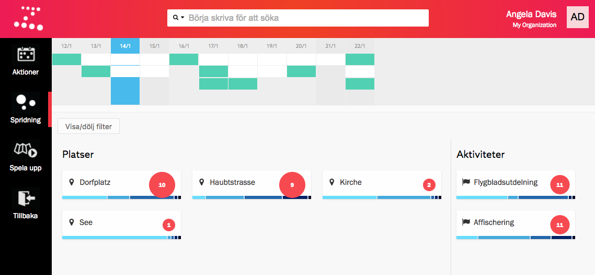
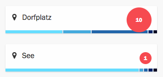
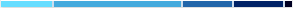
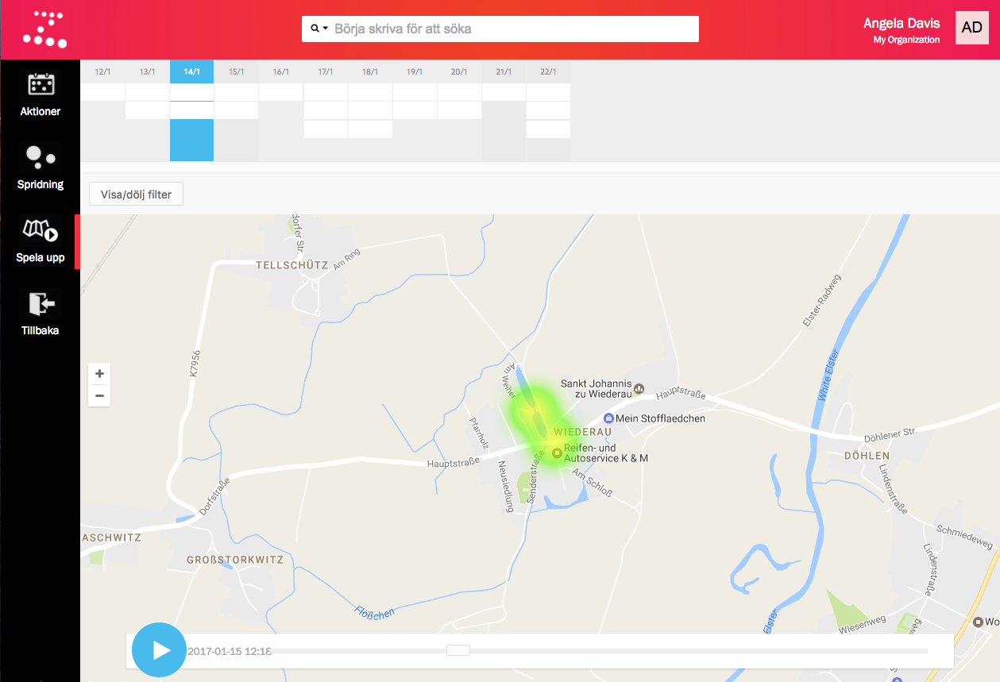

En fördel med att använda Zetkin för att organisera dina kampanjer är att du
samlar på dig detaljerad statistik som kan vara värdefull både för att utvärdera
en kampanj och för att planera nästa.

> Fler sätt att presentera statistik över kampanjer är planerade och kommer att
> finnas i framtida versioner av Zetkin.

Zetkin har flera olika verktyg som hjälper dig visualisera och förstå olika
aspekter av dina kampanjer.

## Spridning
Med verktyget _Spridning_ i Zetkin Organize kan du lätt få överblick över hur
aktioner distribuerats mellan olika platser, aktiviteter och tider på dygnet.
Det är hjälfullt inte minst när du planerar en kampanj. Du hittar spridningsvyn
i _Kampanj_-sektionen i Zetkin Organize.

> Håll musen över en plats eller aktivitet för att markera relevanta aktioner
> i kalendern.

Överst i vyn kan du se en miniatyrkalender där alla aktioner i den valda
kampanjen visas. I nederkant ser du listor på platser och aktiviteter med röda
och blåa diagram som berättar om hur ofta aktioner förekommer på varje plats
respektive med varje aktivitet.

### Mellan platser och aktiviteter
Varje plats eller aktivitet som förekommer i en aktion visas i form av ett kort
med namn och en röd boll som indikerar antalet förekomster.

En stor boll betyder att platsen/aktiviteten är vanligare än genomsnittet, och
en liten boll indikerar att platsen/aktiviteten är mindre vanlig. På det här
sättet får du snabbt överblick huruvida ni har en någorlunda jämn spridning
över olika platser och mellan olika aktiviteter.

### Mellan tider på dygnet

> För musen över de olika sektionerna i stapeldiagrammet för att markera
> aktioner av just den typen, på just den delen av dygnet, i kalendern.

På varje plats- eller aktivitetskort finns också ett stapeldiagram i fem
nyanser av blått. Staplarna indikerar hur vanligt det är med aktioner av den
aktuella typen eller på den aktuella platsen under olika tider på dygnet,
baserat på när de startar.

De olika färgerna korrelerar till olika klockslag enligt följande tabell:

| Färg       | Tid på dygnet    | Klockslag
|------------|------------------|---------------
| Cyan       | Morgon           | 04:00 - 09:00
| Ljusblå    | Förmiddag        | 09:00 - 13:00
| Mellanblå  | Eftermiddag      | 13:00 - 17:00
| Mörkblå    | Kväll            | 17:00 - 22:00
| Blåsvart   | Natt             | 22:00 - 04:00

Den här funktionen gör det enkelt att upptäcka om du råkat planera en viss
aktivitet på en tid på dygnet då det inte passar, eller på en plats vid en
tid då det brukar vara folktomt.

## Spela upp på karta
Du kan spela upp en kampanj på en karta för att få en upplevelse av hur den
kommer att utspela sig över tid och geografiskt. Du hittar funktionen i
undersektionen _Spela upp_ under _Kampanj_-sektionen.

När du trycker på play-knappen spelas tiden från första aktionens starttid
till sista aktionens sluttid upp i ungefär 60 000 gånger verklig hastighet.
Varje aktion visas på kartan och om det sker många aktioner parallellt blir
visas det extra intensivt.

Till skillnad från spridningsvyn i föregående avsnitt får du här ingen exakt
information om hur många aktioner som sker på varje plats, men istället kan du
se hur aktionerna inträffar över tid i olika delar av din stad. De båda
funktionerna utgör således goda komplement av varandra såväl när du planerar
en kampanj som när du vill analysera den i efterhand.

Se också guiden [Planera en kampanj](/sv/for-funktionarer/guider/planera-en-kampanj).
