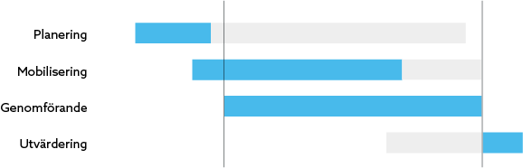

Kampanjen kan delas upp i fyra faser utifrån vilken typ av arbete som sker vid
olika tillfällen under kampanjens livstid: _planering_, _mobilisering_,
_genomförande_ respektive _utvärdering_. De fyra faserna överlappar varandra i
viss utsträckning, även om de olika typerna av arbete varierar i intensitet.

> Med visst överlapp går varje kampanj genom faserna planering, mobilisering,
> genomförande och utvärdering.

Illustrationen visar hur de olika faserna är som mest intensiva (blått) inför,
under eller efter de datum som omfattas av kampanjens start och slutdatum.
Samtidigt fortsätter såväl planerings- och mobiliseringsarbete även under
kampanjens genomförande, och utvärderingen börjar ofta innan kampanjen är slut.
I illustrationen är dessa mindre intensiva perioder i respektive fas gråa.

> Den här sidan handlar bara om den del av en kampanj som organiseras genom
> Zetkin, d.v.s. utåtriktad aktivism. Politiskt innehåll och dylikt förutsätts
> redan vara färdigplanerat.

Zetkins många verktyg för att hantera och analysera kampanjer, aktioner och
deltagare används olika intensivt under respektive fas.

## Planering
Framgångsrikt utåtriktat kampanjarbete föregås av genomtänkt planering. Här görs
planen för vad kampanjen ska innehålla för aktiviteter, när och var för att få
rätt spridning utifrån de mål som satts upp för kampanjen.

Under planeringsfasen skapar du aktioner i kampanjkalendern, och analyserar
samtidigt kontinuerligt hur aktionerna påverkar spridningen över tid,
geografiskt och mellan olika typer av aktioner med hjälp av kampanjverktygets
funktioner _Spridning_ och _Spela upp_.

* [Läs om att skapa och redigera aktioner](../aktioner/skapa-och-redigera)
* [Läs om att analysera kampanjens spridning i tid och rum](../analysera)
* [Läs guiden "Planera en kampanj"](/sv/for-funktionarer/guider/planera-en-kampanj)

## Mobilisering
Med Zetkin är det lätt för aktivister att anmäla sig och delta i
kampanjaktioner. Men anmälningar kommer sällan ske spontant. För att aktivister
ska känna till att kampanjen äger rum måste du mobilisera.

Mobilisering kan ske på flera olika sätt. Det som kräver minst ansträngning är
att i organisationens egna kanaler (sociala medier, nyhetsbrev, möten m.m.)
uppmana aktivister att själva logga in på Zetkin och anmäla sig.

> Med _aktiveringsgrad_ menas andel av målgruppen (exempelvis alla medlemmar)
> som deltar i en kampanj. En aktiveringsgrad på 50% innebär att hälften av alla
> medlemmar deltar på något.

För att nå riktigt hög aktiveringsgrad – 50% är inte ovanligt – krävs mer aktivt
mobiliseringsarbete, exempelvis över telefon. Zetkins system för rundringningar
är ett kraftfullt verktyg för att mobilisera till kampanjer, eftersom ringare
kan anmäla personer till specifika aktioner direkt över telefon.

Mobiliseringen börjar ofta så fort det finns aktioner planerade, och pågår en
bra bit in i kampanjen, ibland ända fram till slutet beroende på hur väl man
lyckats mobilisera från början.

* [Läs om att delta i kampanjer (aktivistmanualen)](/sv/for-aktivister/kampanjer/)
* [Läs om att jobba med rundringningar](../../rundringningar)
* [Läs guiden "Mobilisera med ringuppdrag"](/sv/for-funktionarer/guider/mobilisera-med-ringuppdrag)

## Genomförande (organisering)
När kampanjen väl drar igång börjar ett dagligt arbete med att organisera
aktioner i den närmsta framtiden. Ofta sker det genom att man varje dag kollar
till Zetkin och gör färdigt eventuella aktioner inför morgondagen. Att göra en
aktion redo för genomförande handlar främst om följande:

* Hantera inkomna anmälningar, och boka in på aktioner
* Eventuellt hitta ännu en aktivist för att slippa ställa in en aktion som
  annars har för få anmälda.
* Utse en av deltagarna till ansvarig (och stäm av med personen)
* Skicka ut påminnelser till alla deltagare

Exakt vad varje moment innebär beror såväl på omständigheterna som på hur just
din organisation föredrar att arbeta. Normalt handlar det om ett par minuters
arbete per aktion.

* [Läs om anmälningar och bokningar](../aktioner/bokningar)
* [Läs om aktionspåminnelser](../aktioner/paminnelser)
* [Läs guiden "Genomför en kampanj"](/sv/for-funktionarer/guider/genomfor-en-kampanj)

## Utvärdering
Under kampanjens slutskede och efter att den avslutats är det alltid klokt att
utvärdera kampanjen. Här kan Zetkin komma väl till användning för att bland
annat tillhandahålla statistik över de genomförda aktionerna.

Zetkin kan också användas för att exempelvis genomföra en enkät med alla
personer som deltagit i kampanjen. Vilka det är hittar man enkelt med smarta
sökningar.

* [Läs om att analysera en kampanj](../analysera)
* [Läs om smarta sökningar](/sv/for-funktionarer/manniskor/smarta-sokningar/)
