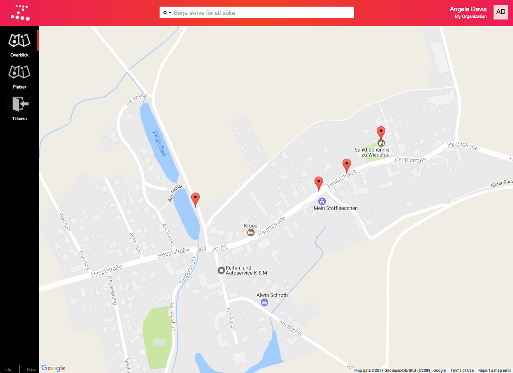

Mycket av det du jobbar med i Zetkin har någon form av geografisk koppling.
Enskilda aktioner äger rum på geografiska platser, kampanjer har en geografisk
spridning, människor i persondatabasen bor på olika platser i staden, o.s.v.

Zetkins kartverktyg syftar till att ge dig som organisatör bättre överblick,
och verktyg för att analysera din organisations geografi.

I dagsläget används kartverktyget enbart för att hantera platsdatabasen som
används för kampanjaktioner. Flera andra verktyg för _GIS (Geographic
Information System)_ finns planerade.

## Hantera platser

> Läs mer om kopplingen mellan platser och aktioner i
> [Kampanjens terminologi](/sv/for-funktionarer/kampanjer/grunderna/).

I Zetkin har din organisation en databas över platser där kampanjaktioner
kan planeras och genomföras. Genom att spara platserna i en databas kan Zetkin
sammanställa statistik, underlätta sökningar och dylikt.

Platser kan du skapa i samband med att du skapar en aktion, men du kan också
hantera alla dina platser, och skapa fler, i _Kartor_-sektionen i Zetkin
Organize.

[Läs mer om att skapa och redigera platser](./platser)
