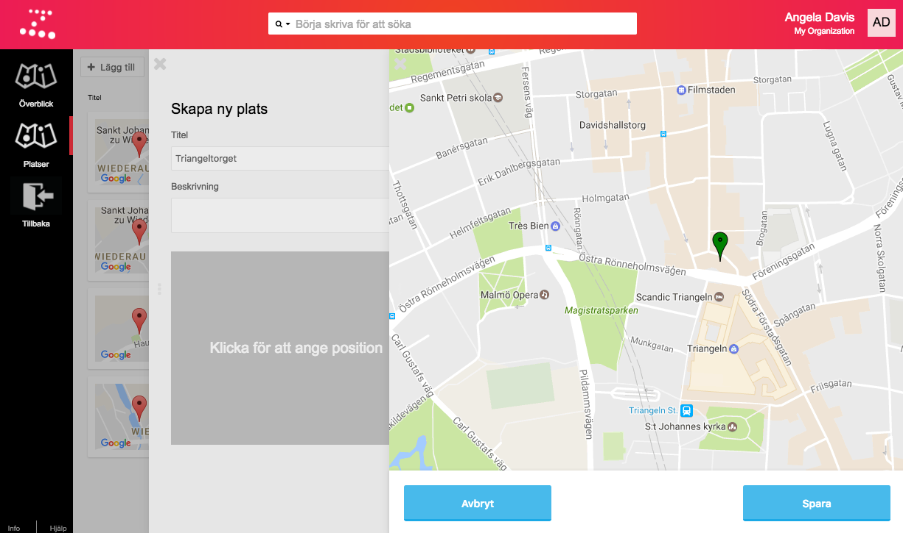

Du kan se dina sparade platser på överblickskartan i _Kartor_-sektionen i Zetkin
Organize, eller i from av en lista i undersektionen _Platser_. Du kan klicka på
en plats för att få upp detaljer. I undersektionen _Platser_ kan du även skapa
nya platser.

## Skapa platser
I anslutning till platslistan i _Kartor_-sektionens undersektion _Platser_ finns
en knapp med texten "Lägg till". Klicka på den för att få upp en panel där du
kan skapa en ny plats. I panelen anger du ett namn på platsen samt en eventuell
beskrivning. Du måste också ange platsens geografiska position. Om du klickar på
den tomma kartan med texten "Klicka för att ange position" öppnas en ny panel
med en interaktiv karta.

I kartpanelen kan du flytta runt den gröna markören för att ange på vilken
geografisk position som din nya plats ligger. Klicka på "Spara" i kartpanelen
för att bekräfta positionen, och "spara" igen i panelen _Skapa ny plats_ för
att lägga till platsen i databasen.

## Redigera platser
Du kan öppna befintliga platser i en egen panel genom att klicka på dem i listan
eller överblickskartan. Från denna panel kan du redigera platsen.

Klicka på "Redigera"-länken för att byta namn eller redigera platsens
beskrivning. Klicka på kartan för att flytta platsen geografiskt, på samma sätt
som när du skapade platsen.

Du kan också sätta etiketter på platser, på samma sätt som du kan göra med
personer. Detta kan vara ett kraftfullt sätt att gruppera platser, exempelvis
därför att de hör till samma geografiska område, eller för att de är platser av
samma typ (pendlarknutpunkter, köpcentra, torg, eller dylikt).

I dagsläget används inte platsetiketter någonstans i Zetkin, men verktyg inom
flera användningsområden är planerade.
