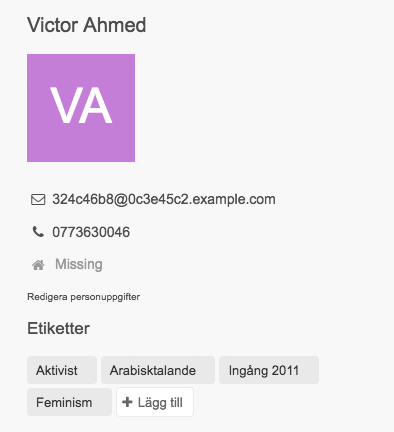
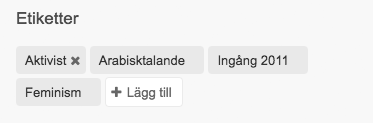
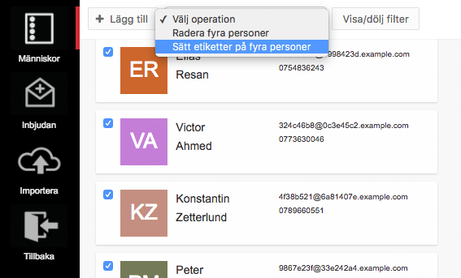

> Tänk på att bara lagra sådan information som tillåts av era medlemmar och
> aktuell lagstiftning.

Du kan etiketter hur du vill. För att ange grupptillhörigheter inom
organisationen, märka upp intressen, språkkunskaper eller vad som helst. Det
är helt och hållet upp till din organisation vilka etiketter ni använder och
i vilken utsträckning.

## Hur kan du använda etiketter?
Personetiketter används på flera olika sätt i Zetkin. Du kan bland annat använda
etiketter i [smarta sökningar](../smarta-sokningar) eller för att ange målgrupp
för [ett ringuppdrag](/sv/for-funktionarer/rundringningar). Du kan också använda
etiketter för att prioritera eller exkludera olika grupper för specifika ringare
i ett ringuppdrag.

## Skapa och redigera etiketter
Du behöver inte i förväg skapa etiketter, utan kan skapa dem i samband med att
du vill sätta etiketter på en viss person. Om du vill redigera en etikett, till
exempel lägga till en beskrivning, kan du göra det samtidigt.

## Ange etiketter för en person
Öppna personsammanfattningen för den person du vill arbeta med, exempelvis genom
att [välja personen i personlistan](../personlistan) eller genom att
[söka fram personen](/sv/for-funktionarer/zetkin-organize/sok). I
sammanfattningen finns en sektion som heter "Etiketter"

### Lägg till etiketter på en person
Klicka på "Lägg till" för att sätta etiketter på personen. I den panel som
öppnas kan du välja bland befintliga etiketter, eller skapa en ny etikett genom
att klicka på knappen "Skapa ny etikett". För nya etiketter måste du ange ett
namn, och en valfri beskrivning.

Klicka på de etiketter du vill lägga till på personen. När du är nöjd klickar
du på knappen "Välj etiketter".

### Ta bort etiketter från en person
Om du vill ta bort en etikett från en person behöver du bara klicka på det
lilla krysset på etiketten i personsammanfattningen.

Etiketten tas bort från personen, men finns kvar för att användas på andra
människor eller i framtiden.

## Sätt etiketter på många samtidigt
> Du kan även sätta etiketter på många samtidigt när du [importerar personer](../importera).

Om du vill sätta etiketter på flera samtidigt kan du göra det i personlistan.
Markera de personer du vill sätta etiketter på och välj "Sätt etiketter på
personer" från listan som visar sig i verktygsraden längst upp.

I panelen som öppnas kan du välja vilka etiketter du vill sätta på personerna,
på samma sätt som när du sätter etiketter på en enskild person.

På det här sättet kan du med olika verktyg filtrera fram en grupp människor
och sedan sätta etiketter på samtliga eller ett urval av dem.
