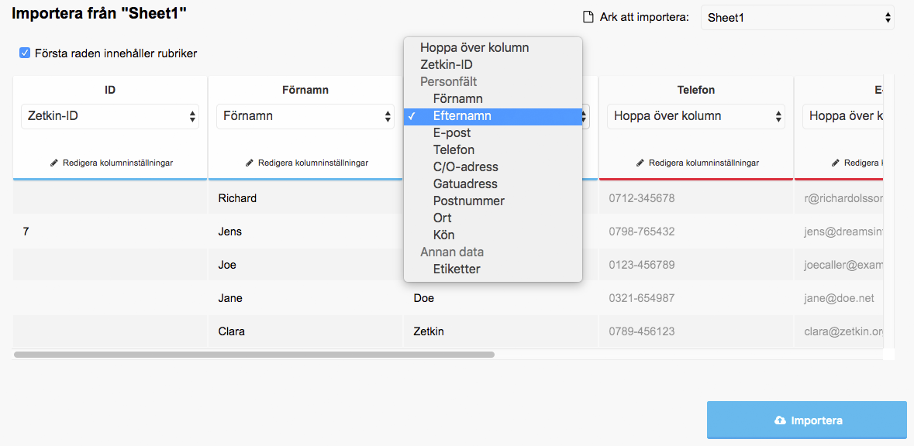
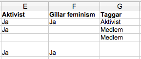

Zetkins importfunktion kan också användas för att uppdatera befintliga
personuppgifter i stor skala eller för att sätta olika etiketter på många
människor samtidigt.

Läs mer om hur Zetkins importverktyg fungerar nedan, eller titta på guiden
[Importera dina medlemmar](/sv/guider/importera-dina-medlemmar) för ett
exempel med instruktioner steg för steg.

## Importera Excel-filer
Zetkins import-funktion kan ta emot filer från alla de senaste versionerna av
Microsoft Excel (xls och xlsx). Om en fil innehåller flera kalkylblad får du
välja under importen vilket blad du vill hämta data från.

Under _Människor_ i Zetkin Organize hittar du import-sektionen. Där kan du dra
och släppa din Excel-fil för att importera den. Efter att du ställt in hur du
vill att Zetkin ska tolka filen trycker du på "Importera". När importen är
färdig får du information om hur många människor som importerats.

## Vad vill du importera?
> Om översta raden i din fil utmärker sig tolkar Zetkin den som rubriker. Du
> kan själv ställa in hur Zetkin ska tolka första raden.

När du laddar in en Excel-fil försöker Zetkin tolka de olika raderna och
kolumnerna. Tomma kolumner ignoreras.

Om Zetkin inte kan gissa, eller gissar fel, måste du ställa in vad varje kolumn
innehåller, och har möjlighet att bestämma vilka kolumner som ska importeras,
och hur.

### Personuppgifter
Det vanligaste är att man vill importera personuppgifter, såsom namn, adress,
e-postadresser och telefonnummer.

> Varje rad i en importfil motsvarar en person, och varje kolumn motsvarar ett
> fält (till exempel namn eller adress) för respektive person.

För att Zetkin ska kunna förstå denna typ av information vid en import behöver
du bara välja vilket fält som respektive kolumn motsvarar. De fält du kan välja
på är:

* Förnamn
* Efternamn
* E-post
* Telefon
* C/O-adress
* Gatuadress
* Postnummer
* Kön

### Etiketter
I Zetkin kan du [använda etiketter](../etiketter) för att lättare organisera en
växande personlista. När du importerar personer kan du samtidigt sätta etiketter
baserat på innehållet i kolumner.

Det finns inga strikta regler för hur etikettkolumner ska se ut, utan du kan
använda importverktygets kolumninställningar för att översätta värden till
etiketter.

Två vanliga metoder är att antingen ha en kolumn per etikett, eller en kolumn
där olika värden betyder olika etiketter. Låt oss utgå från ett exempel.

Om vi i Zetkin har tre etiketter som heter _Aktivist_, _Feminism_ och _Medlem_
skulle ett utdrag ur en importfil kunna se ut såhär, där varje rad är en
person:

Ett "Ja" i kolumn E betyder att personen ska ha etiketten _Aktivist_. Ett "Ja"
i kolumn F betyder att personen ska ha etiketten _Feminism_. Beroende på vilket
värde som står på respektive rad i kolumn G ska personer antingen få etiketten
_Aktivist_, _Medlem_ eller ingen alls.

> Om du vill kan du koppla värden i en kolumn till flera etiketter. Vissa värden
> kan kopplas till en etikett och andra till flera i samma kolumn.

När du väljer att en kolumn innehåller etikettinformation försöker Zetkin gissa
vad de olika värden som finns i kolumnen betyder. Om du anger namn på etiketter
som existerar, som med kolumn G i exemplet, kommer Zetkin automatiskt koppla
värden till etiketter.

I andra fall, som med kolumn E och F där värdet "Ja" inte uppenbart motsvarar
en viss etikett, måste du manuellt ställa in vilken etikett ett "Ja" ska kopplas
till.

Du kan se direkt i förhandsvisningen vilka människor som kommer att få vilka
etiketter när du importerar. Efter importen får du information om hur många
människor som fått etiketter.

## Uppdatera personer i Zetkin
Du kan inte bara importera helt nya människor med Zetkins importverktyg, utan
också uppdatera befintliga människor. För att kunna göra det måste varje rad
innehålla ett Zetkin-ID.

Om någon kolumn heter "ID" eller dylikt kommer Zetkin automatiskt att känna igen
information i kolumnen som Zetkin-ID. Annars måste du själv ange vilken kolumn
som innehåller ID.

Efter importen kan du se hur många människor som skapats respektive uppdaterats.
