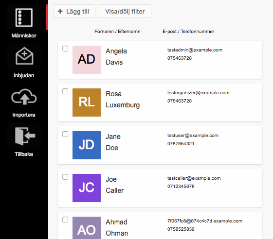
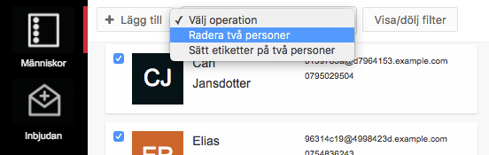

Personlistan är det första du möts av i sektionen _Människor_ i Zetkin Organize.
Du kan lägga till fler personer här, eller klicka på en person för att visa och
redigera hens uppgifter.

## Sortera och filtrera
Du kan sortera listan på förnamn, efternamn, e-postadress och telefonnummer
genom att klicka på respektive rubrik ovanför listan.

Du kan även filtrera vilka resultat som visas i listan. Klicka på _Visa/dölj
filter_ för att få fram olika sätt att filtrera listan.

Här kan du bland annat välja att bara visa personer som matchar en viss
[smart sökning](../smarta-sokningar).

## Lägg till en ny person
> Du kan också lägga till personer genom att [importera](../importera) många på
> en gång eller [bjuda in](../bjud-in) en person att registrera sig själv.

För att lägga till en enskild person klickar du på knappen "Lägg till". En ny
panel öppnas där du får fylla i den nya personen uppgifter. När du klickar på
spara skapas en ny person i listan. En profilbild kommer att genereras
automatiskt med en unik färg och personens initialer.

## Redigera en person
Om du vill redigera uppgifter för en specifik person kan du klicka på personen
i listan. I panelen som öppnas finns en sammanfattning av personen, med en länk
till formuläret för att redigera personuppgifter.

Du kan också komma till sammanfattningen genom att [söka efter personen](/sv/for-funktionarer/zetkin-organize/sok).

## Radera personer
För att radera en person gör du på samma sätt som när du redigerar. I formuläret
hittar du en knapp för att radera personen.

När du raderar en person anonymiseras uppgifterna, men ett anonymt objekt finns
kvar i Zetkins databas. Det är för att all den historik som personen har och som
kan vara viktig för förståelsen av andra delar av din organisations data inte
ska påverkas. Det kan exempelvis vara aktionsdeltagande, enkätsvar och dylikt
som i fortsättning kommer vara kopplat till ett anonymt personobjekt.

Du kan radera flera personer på en gång genom att kryssa i rutan vid repsektive
person och välja "Radera" i den lista som dyker upp i verktygsraden.

Du blir ombedd att bekräfta att du verkligen vill radera flera personer, varpå
Zetkin anonymiserar och döljer alla på en gång.
