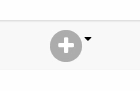
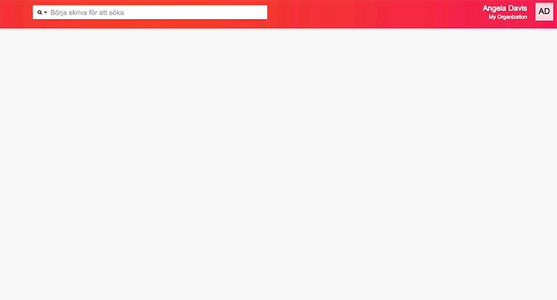

Om du vill hitta personer baserat på vad de svarat i en enkät, hur mycket
de deltagit i kampanjer, om de blivit ringda i ett visst ringuppdrag eller
någon annan information som finns i Zetkin är _smarta sökningar_ den funktion
du är ute efter.

## Skapa och redigera sökningar
Du hittar smarta sökningar i en lista i personlistans filtreringspanel. Där
kan du välja en sökning för att filtrera personlistan, men du kan också skapa
nya eller redigera befintliga sökningar.

Öppna listan och klicka på den lilla pennan vid en sökning för att redigera den.
Om du vill skapa en helt ny sökning skriver du in ett namn, till exempel "Min
sökning", och väljer alternativet _Skapa Min sökning_ i listan.

Då öppnas panelen _Redigera sökning_, där du kan styra sökningens namn och en
beskrivning av sökningen, samt redigera de filter som sökningen består utav.

## Sökningar består av filter
Smarta sökningar byggs upp av en serie filter som antingen matchar eller inte
matchar människor. Du kan själv styra vilka filter en sökning består av, och
i vilken ordning.

Det finns flera olika typer av filter som kan användas för att söka baserat
på olika typer av Zetkin-data. Du lägger till ett nytt filter genom att välja
i listan _Lägg till filter_. Varje filter som du lägger till får ett eget kort
i panelen, där du kan ändra inställningar för filtret. Du kan flytta filter för
att byta ordning.

Om du vill ta bort ett filter klickar du på det lilla krysset i filtrets övre
högra hörn.

## Filter kan utöka eller begränsa
Ett filter beskriver ett sökkriterium som människor antingen stämmer in på
eller inte. Ett filter kan exempelvis matcha alla med förnamnet "Anna".

När du bygger sökningar av flera filter kan ett filter användas antingen för
att utöka sökningen, eller för att begränsa den. Ett filter som söker efter
förnamnet "Anna" kan följas av ett filter som söker efter efternamnet "Diaz".

Om det sistnämnda filtret används för att _utöka_ sökningen kommer den att
resultera i alla personer som antingen heter "Anna" i förnamn eller "Diaz" i
efternamn.

> Det går också att söka på alla som heter Anna i förnamn _och_ Diaz i efternamn
> genom inställningar i filtret för personuppgifter.

Om det istället används för att _begränsa_ sökningen kommer den att resultera
i alla personer som heter "Anna" i förnamn _men som inte_ heter "Diaz" i
efternamn.

Du väljer om ett filter ska utöka eller begränsa resultatet av de tidigare
filtren genom att välja plus eller minus i sammanfogningskontrollen mellan
filtren.

På det här viset kan du bygga komplexa sökningar bestående av en mängd filter
i vilken ordning du vill.

### Filtrera på personuppgifter
Det enklaste filtret söker baserat på personuppgifter såsom namn, e-postadress,
telefonnummer och dylikt. Du kan söka på ett enskilt eller flera fält på en
gång.

Om du söker på flera fält måste en person matcha samtliga fält för att anses
matcha filtret. Det innebär att ett personfilter med de två fälten förnamn
och efternamn bara matchar personer som både har rätt förnamn och rätt
efternamn.

### Filtrera på etiketter
Du kan filtrera på flera olika sätt baserat på personers etiketter. Du kan söka
på enskilda etiketter eller på flera etiketter, och välja att bara matcha
människor som har alla de utvalda etiketterna, eller bara har en av dem.

### Filtrera på kampanjdeltagande
Med filtret _Kampanjdeltagande_ kan du filtrera beroende på huruvida människor
deltagit (eller inte deltagit) i en viss kampanj eller alls i någon kampanj.

Du kan avgränsa filtreringen till att bara gälla fram till idag, från och med
idag (i framtiden) eller mellan vissa datum. Genom att använda två kampanjfilter
efter varandra kan du på så vis skapa en smart sökning som filtrerar fram alla
som deltagit förut, men som inte har några bokningar i framtiden.

### Filtrera på ringhistorik
Filtret _Ringhistorik_ filtrerar baserat på hur människor blivit ringda. Du kan
avgränsa sökningen till specifika ringuppdrag och i tiden. På så vis kan du
exempelvis söka fram personer som blivit ringda någon gång under de senaste
fem dagarna, före ett visst datum eller mellan två datum.

Genom att använda två ringhistorikfilter efter varandra kan du söka fram alla
som blivit ringda men filtrera bort dem som också blivit nådda. På så vis vet
du vilka ni försökt ringa men inte nått.

## Återanvänd sparade sökningar
Smarta sökningar tar lite tid att bygga samman, och därför kan du spara dem så
att du inte måste göra om dem varje gång. Du kan exempelvis ha sparade sökningar
för sådant som du använder ofta: En lista på de mest aktiva aktivisterna, en
lista över personer din organisation pratat med de senaste månaderna, en lista
över personer med någon av tre olika etiketter eller dylikt.

## Hitta snabbt till en smart sökning
Med Zetkins vanliga sökfunktion, d.v.s. sökfältet längst upp i Zetkin Organizes
gränssnitt, kan du söka fram smarta sökningar. Om du skapat en sökning som heter
"Min sökning" kan du söka efter "Min sökning" i sökfältet.

Zetkin hittar den sparade sökningen och du kan öppna resultatet av sökningen,
d.v.s. en lista på människor, i en egen panel. Därifrån kan du också enkelt
öppna den separata panelen för att redigera sökningen.

## Smarta sökningar är dynamiska
Smarta sökningar utförs inte när du skapar dem, utan när du visar dem. Det
betyder att sökresultatet kan ändras över tid, om omständigheterna som sökningen
baseras på förändras.

Om du har en smart sökning som filtrerar fram människor med kampanjbokningar
i framtiden, och Anna gjorde sin sista flygbladsutdelning idag betyder det att
hon inte längre matchar sökningen, trots att hon gjorde det igår (då dagens
bokning låg i framtiden).

Detta är en väldigt kraftfull funktion, som innebär att du inte behöver
uppdatera sökningarna när människor fyller i enkäter, bokar in sig på kampanjer
eller de parametrar du söker efter på något annat sätt förändras.
