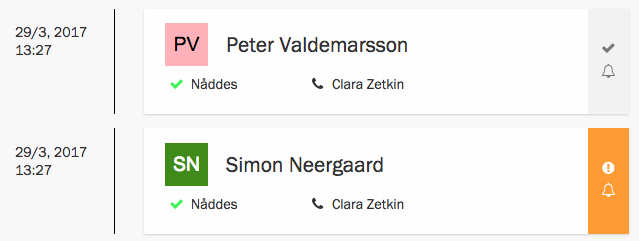
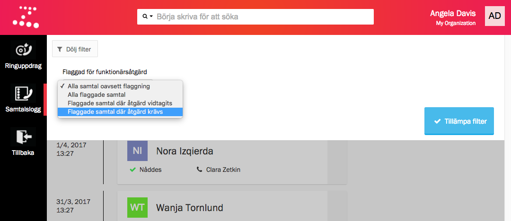

Du hittar loggen i _Dialog_-sektionen i Zetkin Organize. Samtalsloggen är en
lista på alla samtal som sparats.

> Allokeringstid avser den tid då ringkön valde ut målpersonen åt ringaren,
> vanligtvis precis innan samtalet ringdes.

Direkt i listan du kan se tiden då samtalet allokerades, vem som ringde och vem
som blev ringd, och hur samtalet gick. Klicka på ett samtal i loggen för att få
upp mer detaljer och statusinformation.

## Flaggade samtal
Ifall en situation som ringaren inte kan lösa uppstår under ett samtal kan hen
flagga ett samtal för att uppmärksamma en funktionär. Sådana samtal markeras i
samtalsloggen med en klockikon mot orange bakgrund.

Som funktionär kan du öppna upp samtalet och läsa ringarens notering om det som
uppstått. När du vidtagit den åtgärd som krävs kan du markera samtalet som
åtgärdat.

## Filtrera loggen
Du kan använda filterfunktionen för att filtrera samtalsloggen och snabbt hitta
samtal som behöver åtgärdas.

> Alternativet _Flaggade samtal där åtgärd krävs_ är ett bra sätt att få fram
> en lista som du kan arbeta med tills den är tom.

Välj ett alternativ i listan _Flaggad för funktionärsåtgärd_ och klicka på
knappen _Tillämpa filter_ för att filtrera listan. De olika
filtreringsalternativen är:

* _Alla samtal oavsett flaggning_ visar alla samtal.
* _Alla flaggade samtal_ visar alla samtal där ringaren uppgett att en
  funktionär måste vidta en åtgärd, oavsett om samtalet redan åtgärdats.
* _Flaggade samtal där åtgärd vidtagits_ visar samtal som tidigare flaggats,
  men där en funktionär sedan markerat samtalet som åtgärdat.
* _Flaggade samtal där åtgärd krävs_ visar de samtal som återstår att åtgärda.
