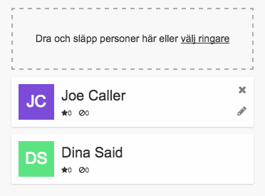

Det är enbart de aktivister som utsetts till ringare som har tillgång till ett
ringuppdrag i Zetkin Call. Detta är viktigt, eftersom ringare under ringningen
får tillgång till information om den person de ringer, som inte är tillgänglig
för vem som helst.

Därför är det viktigt att du som funktionär utser vilka som ska vara ringare i
ett visst uppdrag. Det gör du i ringuppdragspanelen i Zetkin Organize.

## Lägg till och ta bort ringare
Längst ned i ringuppdragspanelen finns sektionen "Ringare". Du lägger till en
ringare genom att klicka på länken "välj ringare" och välja den person du vill
lägga till i panelen som öppnas.

Du kan också dra och släppa en person till den streckade ytan för att lägga till
hen som ringare. Det innebär att du exempelvis kan använda Zetkins sökfunktion
för att söka fram en person som du sedan utser till ringare genom att klicka och
dra hens avatarbild till ringuppdraget.

Du tar bort en ringare genom att klicka på det lilla krysset på ringarens kort.

## Anpassa ringares målgrupper
Ringare har olika goda förutsättningar för att ringa olika personer i
målgruppen. Beroende på saker som språkkunskaper, gemensamma intressen och vilka
andra uppgifter man har i organisationen kan man ibland föredra att en viss
ringare i första hand ringer vissa målpersoner, och inte andra.

I Zetkin kan du styra över detta med prioriterade respektive exkluderade
etiketter. Du kan se i listan över ringare hur många etiketter som prioriterats
respektive exkluderats för varje ringare. Klicka på en ringare för att ändra
inställningarna.

### Prioritera etiketter för ringare
> Tänk på att etiketter ska användas med respekt för personlig integritet.
> En etikett som avser språkkunskaper kan vara ok, medan en etikett som anger
> etnicitet skulle anses av de flesta vara integritetskränkande.

Om en ringare fått prioriterade etiketter utsedda innebär det att Zetkin i
första hand kommer att tilldela just den ringaren målpersoner med matchande
etiketter. Om ringaren Dina har "Engelska" som prioriterad etikett kommer hon
att i första hand ringa de personer i ringkön som har etiketten "Engelska".

Prioriteringen innebär inte att andra ringare aldrig kommer ringa personer
med den aktuella etiketten, bara att Dina ringer dem innan hon börjar ringa
andra.

Det betyder att om Dina slutar ringa kommer personer med etiketten "Engelska"
fortfarande att bli ringda av någon annan.

### Exkludera etiketter för ringare
Om en ringare fått en etikett exkluderad innebär det att Zetkin plockar bort
alla de målpersoner som har den aktuella etiketten från ringarens ringkö. Om
du exkluderar samma etikett från alla ringare kommer personer med den
etiketten aldrig att bli ringda.

Använd exkluderade etiketter i kombination med prioriterade etiketter för att
segmentera målgruppen mellan två eller flera ringare. Om du vill exkludera
alla personer med en viss etikett ur uppdraget helt och hållet, för alla
ringare, är det antagligen enklare att göra det direkt med hjälp av ett
etikettfilter i den smarta sökning som definierar målgruppen.
