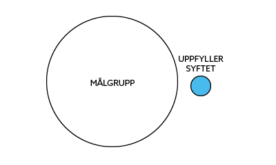
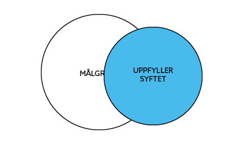
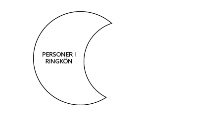
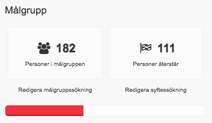

Det är först när ett ringuppdrag skapats och aktivister blivit tilldelade
ringuppdraget som rundringningen kan börja.

## Uppdragets beståndsdelar
Precis som det mesta annat i Zetkin skapas ringuppdrag i Zetkin Organize. När
man [skapar ett ringuppdrag](../skapa-ringuppdrag) måste man fylla i viss
information, som utgör uppdragets olika beståndsdelar. Det handlar främst om:

* Grundläggande information (namn, beskrivning m.m.)
* Instruktioner till ringare
* Lista på ringare
* Sökning som utgör målgruppen
* Sökning som definierar syftet med ringningen

## Ringare och målpersoner
Ringuppdrag omfattar alltid två grupper av människor. De personer som ska bli
ringda under uppdraget, och de personer som ska ringa.

> Zetkin Call är den app där ringare genomför en rundringning. Läs mer i
> aktivistmanualen [om Zetkin Call](/sv/for-aktivister/ringa-med-zetkin/innan-du-borjar/).

Den grupp som tilldelats ett ringuppdrag kallas _ringare_. De får tillgång till
uppdraget i Zetkin Call, verktyget för att genomföra rundringningar. Ringare
väljs ut manuellt av en funktionär när uppdraget skapas, eller i efterhand
genom att redigera uppdragets inställningar i Zetkin Organize.

De personer som ska bli ringda är _målpersoner_ ("targets"). Det kan vara vilka
personer som helst ur persondatabasen. De väljs ut dynamiskt av Zetkin baserat
på två [smarta sökningar](/sv/for-funktionarer/manniskor/smarta-sokningar/)
som skapas som en del av ringuppdraget.

De båda sökningarna motsvarar dels en generell målgrupp, dels en beskrivning av
uppdragets mål eller syfte. De personer som blir utvalda placeras i en kö och
kommer att bli ringda i tur och ordning av ringarna.

## Målgrupp, syfte och ringkö
För att förstå hur Zetkins ringuppdrag skiljer på målgrupp, syfte och de
personer som i slutändan blir placerade i ringkön och ringda hjälper det att
utgå ifrån ett exempel.

Ringuppdrag kan vara användbara exempelvis för att mobilisera deltagare till en
kampanj. Syftet är då att boka in personer på aktioner i kampanjen. För att
mobilisera effektivt är det klokt att ringa främst till dem som har en historia
av att delta i kampanjer. Dessa utgör då målgruppen.

> Smarta sökningar består av en serie filter som du kan styra helt själv. Det
> finns en separat sektion i manualen om
> [smarta sökningar och filter](/sv/for-funktionarer/manniskor/smarta-sokningar/).

I ringuppdraget ska både målgrupp och syfte uttryckas som smarta sökningar. En
målgruppssökning kan i det här fallet innehålla ett enda filter som väljer ut
personer som någon gång deltagit i en kampanj, vilken som helst.

### Personer som uppfyller syftet exkluderas
Vi vill ringa alla i målgruppen för att boka in dem. Men vad händer om någon
av dessa aktivister själv går in i aktivistportalen och anmäler sig till en
aktion? Då vore det ju onödigt att ringa dem. Detta löser vi med en smart
syftessökning som väljer ut alla som uppfyller ringuppdragets mål.

> Verkar det krångligt? Zetkin Organize innehåller mallar för vanliga typer
> av ringuppdrag. Läs mer i stycket om att [skapa ringuppdrag](../skapa-ringuppdrag).

I det aktuella exemplet bör den smarta sökning som motsvarar uppdragets syfte
bestå av ett enda filter som väljer personer med framtida bokningar i den
aktuella kampanjen.

När ringuppdraget startar kan de båda grupperna se ut såhär:

Målgruppen består av en stor skara människor, medan antalet människor som
uppfyller syftet, d.v.s. matchar den aktuella smarta sökningen och alltså
har framtida bokningar i den aktuella kampanjen, är litet.

I takt med att personer anmäler sig till kampanjen, på egen hand eller via
telefon i vår rundringning, växer den grupp av människor som uppfyller syftet.

Vissa personer matchar definitionen av målgruppen, men också den sökning som
definierar syftet. De personer som vid varje givet tillfälle ingår i ringkön,
och alltså kommer att bli ringda, är målgruppen minus den grupp som redan
uppfyller syftet.

Det innebär alltså att även om en person tillhör målgruppen kommer hen inte
bli ringd så länge hen också för tillfället uppfyller syftet.

### Urvalet till ringkön är dynamiskt
Eftersom målgrupp och syfte definieras med hjälp av smarta sökningar, och
[smarta sökningar är dynamiska](/sv/for-funktionarer/manniskor/smarta-sokningar/#smarta-skningar-r-dynamiska),
kommer urvalet till ringkön också att ske dynamiskt. Det innebär bland
annat att även om en person uppfyller syftet idag är det inte säkert att hen
gör det i morgon.

Det betyder att en person som blir ringd och inbokad på en aktion automatiskt
försvinner ur ringkön eftersom syftet nu är uppfyllt. När dagen för aktionen
kommer och går är syftet inte längre uppfyllt, eftersom personen inte längre har
några _framtida_ bokningar i kampanjen. Personen hamnar nu åter i ringkön. Ni
kan ringa upp, fråga hur det gick på den där aktionen, och föreslå en ny att
anmäla sig till.

Det samma gäller så klart målgruppen. Personer som aldrig deltagit i en kampanj
men anmäler sig manuellt via aktivistportalen kommer därefter att uppfylla
målgruppssökningen och följaktligen bli ringda så fort aktionsdagen passerat.

Aktuell information om gruppernas storlek finns i Zetkin Organize.

I ringuppdragspanelen kan du hela tiden se hur många personer som ingår i
målgruppen och hur många av dem som för tillfället inte uppfyller syftet.
I underkant finns en mätare som indikerar hur stor andel av målgruppen som
uppfyller syftet.

### Uppdrag utan slut
Sammantaget innebär ovanstående att vissa ringuppdrag aldrig blir klara.
Åtminstone i bemärkelsen att alla personer i målgruppen aldrig samtidigt kommer
uppfylla syftet, exempelvis för att man inte hinner boka in alla på aktioner
innan de aktioner som bokats in redan passerat.

Mätaren i Zetkin Organize, och statistiken i Zetkin Call, kan alltså oftast
inte betraktas som en indikator på hur långt man har kvar till målet. Från en
dag till nästa kan siffrorna rentav verka gå bakåt, utan att det betyder att
man inte gjort några framsteg. Det är viktigt att komma ihåg, inte minst om
man vill använda statistiken för att uppmuntra ringare. 

## Var kreativ
Ringuppdragens målgrupp och syfte kan utnyttja all den kraft som Zetkins smarta
sökningar erbjuder. Du kan vara kreativ i hur du definierar målgrupp och syfte,
med allt från enkla sökningar baserat på etiketter, eller komplexa sammansatta
sökningar med en mängd filter.

När du [skapar ringuppdrag](../skapa-ringuppdrag) kan du också välja att utgå
ifrån färdiga mallar för vanliga ringuppdrag, så att du kan komma igång på
nolltid utan att behöva bry dig om smarta sökningar.
