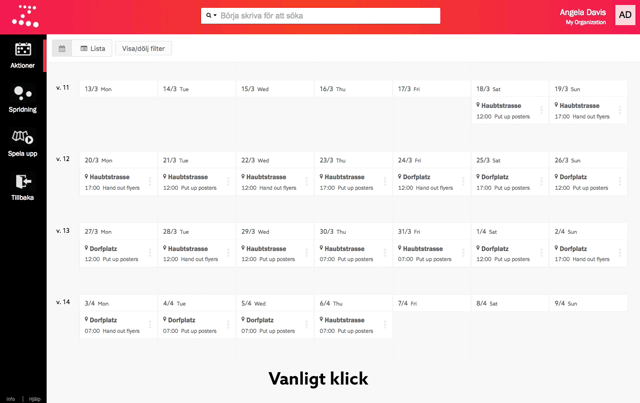

När du vill komma direkt till redigeringspanelen i Zetkin Organize kan du
använda alt-klick. Då håller du nere alt-knappen på ditt tangentbord samtidigt
som du klickar på det objekt du vill öppna i listan. 

Istället för att öppna den relevanta sammanfattningspanelen öppnas då istället
redigeringspanelen.

Det här tipset är väldigt användbart inte minst när du håller på att planera en
kampanj och arbetar intensivt med att skapa och redigera aktioner.
