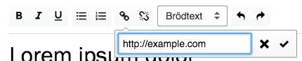

Textredigeraren använder du bland annat för att skriva och formatera
instruktioner till ringare i ett ringuppdrag.

## Formatering
I textredigeraren kan du skriva styckesindelad och formaterad text. Markera
en del av texten och klicka på knapparna i formatraden för att göra texten
fetstilt, kursiv eller understruken.

> Du kan ångra en inmatning eller byte av format genom att klicka på
> ångra-pilen i formatraden.

Du kan också byta format på ett helt stycke från brödtext till rubrik genom
att välja format i listan i formatraden.

## Listor
Du kan skriva numrerade och onumrerade listor genom att välja något av de
båda listformaten i formatraden. Välj flera befintliga stycken och gör om dem
till listor genom att klicka på en av listknapparna, eller klicka först på
knappen och skrev sedan dina listpunkter en efter en.

## Länkar
Du kan skapa länkar till andra sidor (exempelvis till en mer utförlig
ringmanual) genom att markera en text och klicka på länkknappen i formatraden.
En liten ruta öppnas där du får skriva in adressen som du vill att länken ska
peka på.

Om du vill ta bort en länk kan du markera den länkade texten och klicka på
knappen för att bryta länk i formatraden.

## Spara eller avbryt
När du klickar på "Spara och stäng" sparas dina ändringar. Om du istället
klickar på "Stäng utan att spara" kommer dina ändringar att slängas.
