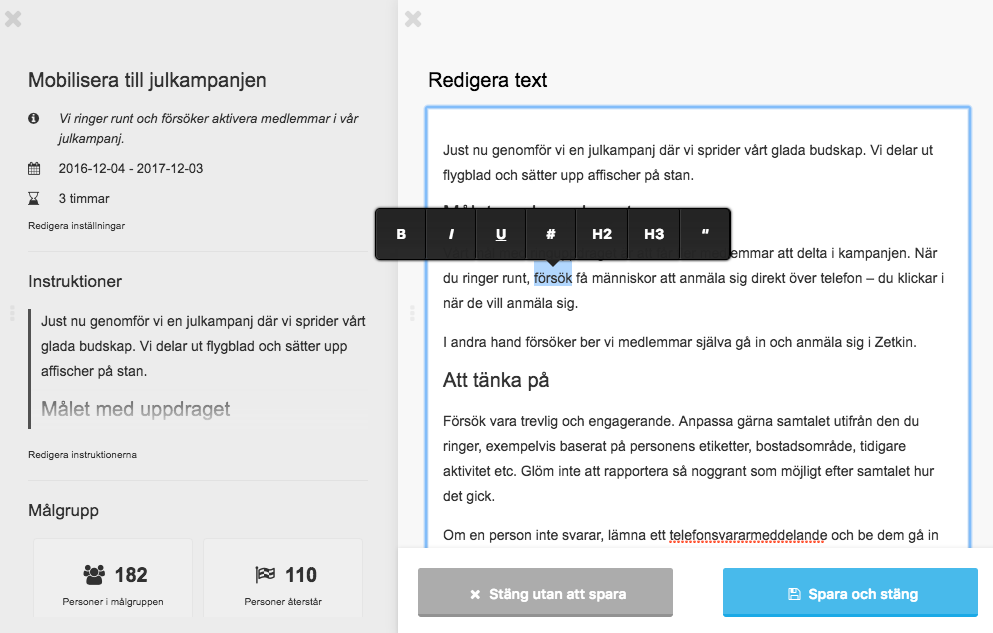

Textredigeraren använder du bland annat för att skriva och formatera
instruktioner till ringare i ett ringuppdrag.

När du markerar text du skrivit i textredigeraren kan du ange om den ska vara
fetstil, kursiv eller understruken. Du kan på samma sätt skapa två olika typer
av rubriker eller blockcitat.

Med _#_-knappen i menyn gör du den valda texten till en länk och anger vilken
webbadress den ska länka till.

När du klickar på "Spara och stäng" sparas dina ändringar. Om du istället
klickar på "Stäng utan att spara" kommer dina ändringar att slängas.
