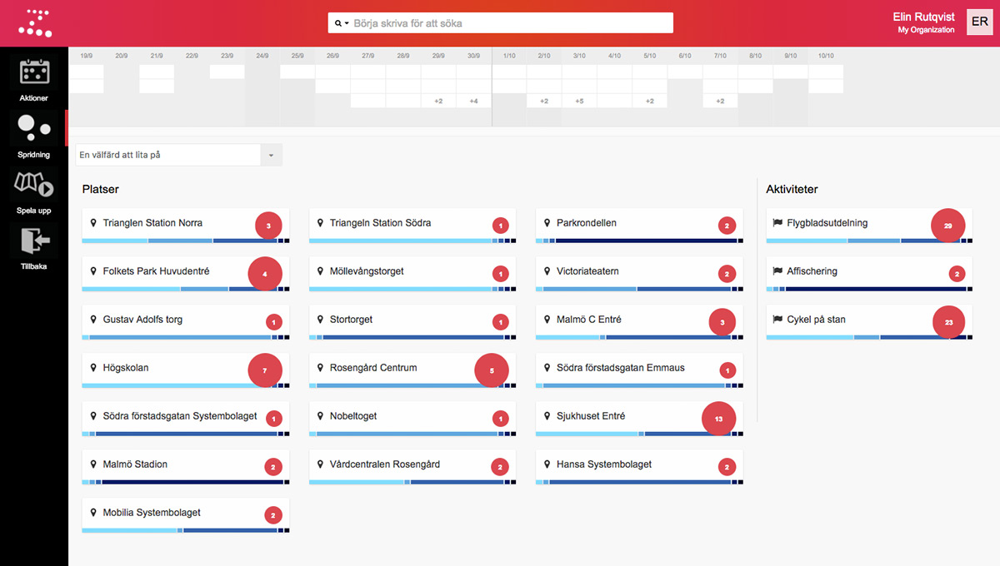

Zetkin Organize hittar du genom att först logga in på aktivistportalen, eller
genom att surfa direkt till [organize.zetk.in](//organize.zetk.in). Det är i
Organize som du som funktionär kommer tillbringa den största delen av din tid
med Zetkin.

Zetkin Organize är en modern webbapplikation. För att du ska kunna använda
den fullt ut behöver du en modern webbläsare. Vi rekommenderar den senaste
versionen av [Firefox](https://firefox.com) eller [Google Chrome](https://google.com/chrome).
Organize är i första hand byggt för att användas på en dator, men stora
delar av appen, främst sådana uppgifter som man ofta vill göra "i farten"
fungerar bra även i smartphones och på surfplattor.

## Grunderna i Zetkin Organize
Hela den här sektionen av manualen handlar om hur man använder Zetkin
Organize för att utföra olika vanliga funktionärsuppgifter. Men innan du
sätter igång med den typen av uppgifter behöver du lära dig grunderna för
hur Organize fungerar.

### Gränssnittet
I kapitlen [Sektioner](./sektioner), [Jobba med paneler](./paneler) och
[Använd sökfunktionen](./sok) får du lära dig hur du kan få ut det mesta
utav Zetkin Organizes gränssnitt.

### Inställningar
I kapitlet [Hantera funktionärer](./funktionarer) får du även lära dig hur
du lägger till fler funktionärer så att fler kan dela på arbetet i Zetkin
Organize.
