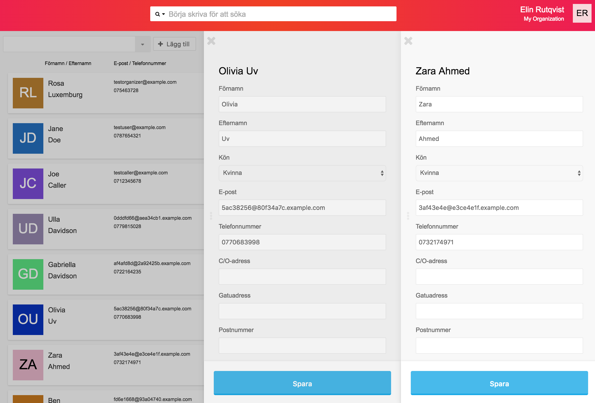
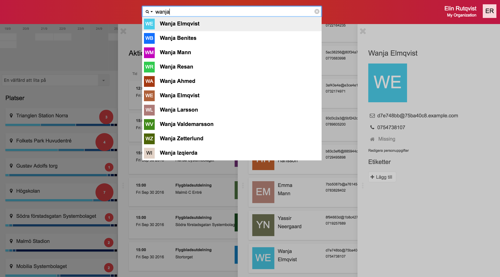
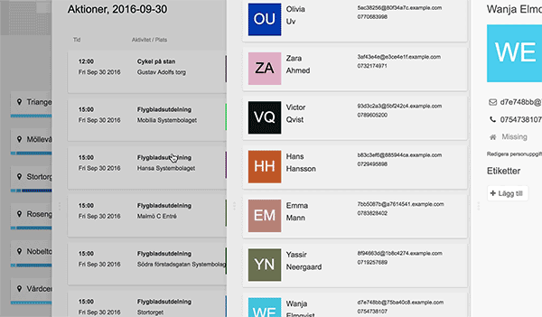

De olika [sektionerna](../sektioner) i Zetkin Organize är bara början. När du
klickar på en person, en aktion eller ett ringuppdrag öppnas dessa i en egen
yta som vi kallar för en panel. Varje gång du klickar på något öppnas det i
en egen panel.

Det här gör att du exempelvis kan öppna två personer och visa dem sida vid
sida för att jämföra.

> Flera paneler kan öppnas sida vid sida, exempelvis för att jämföra och
> redigera två olika personer.

Olika typer av innehåll, exempelvis personer, aktioner, platser och loggade
telefonsamtal har egna sorters paneler. Dessa öppnar du oftast genom att
klicka på en person, en aktion o.s.v. i en lista. Men det finns fler sätt.

## Sök för att öppna paneler
Ett annat vanligt sätt att öppna paneler är genom att söka efter något.
Sökfunktionen finns alltid på samma plats i Zetkin Organize, och oavsett
var du befinner dig kan du söka efter vad som helst. När du väljer bland
sökresultaten öppnas en ny panel.

> Sökresultat öppnas i en ny panel, utan att påverka det du håller på
> med. Läs [mer om sökfunktionen](../sok).

Det gör att du närsomhelst kan söka fram och öppna vad som helst som du
känner är viktigt för det du håller på med, eller som du vill lösa lite
snabbt innan du återgår till det du just gjorde.

## Ordna paneler
Oftast behöver du inte jobba med fler än två-tre paneler, men om det blir
många eller om din skärm är liten kan du behöva flytta runt panelerna.

I mitten av panelernas vänsterkant finns ett litet handtag. Klicka och dra i
handtaget för att flytta panelen i sidled, exempelvis för att dölja den
bakom en annan panel eller flytta den ur vägen.

Med krysset längst upp till vänster i panelen kan du stänga en specifik
panel utan att det påverkar övriga.

## Dra och släpp mellan paneler
I många fall kan du dra personer från en panel till en annan. Det kan
exempelvis vara för att boka in en person på en aktion, eller lägga till
en ny ringare i ett ringuppdrag.

> Genom att dra och släppa personer mellan paneler kan du till exempel
> [boka in dem](/sv/for-funktionarer/kampanjer/aktioner/bokningar)
> på aktioner eller [lägga till ringare](/sv/for-funktionarer/phone-banking/ringare)
> i ett ringuppdrag.

Sammantaget innebär detta att du kan jobba med en aktion i Kampanj-sektionen,
[söka fram en person](../sok) och dra och släppa den på aktionen för att
boka.

Det är detta som gör systemet med paneler i Zetkin Organize så
kraftfullt.
