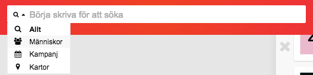

Sökfältet hittar du längst upp i Zetkin Organize. Oavsett vilken sektion du
arbetar i finns sökfältet alltid på samma plats och kan närsomhelst användas
för att söka efter vad som helst.

> __TIPS!__
> Du kan söka ännu snabbare med kortkommandon. Skriv `//` för
> att aktivera sökfältet. Skriv `?` eller läs i manualen för
[fler kortkommandon](/sv/for-funktionarer/tips/snabbtangenter).

Du söker genom att klicka på sökfältet (eller använda ett
[kortkommando](/sv/for-funktionarer/tips/snabbtangenter) för sök) och börja
skriva. Sökresultat hämtas samtidigt som du skriver, men inte förrän du
skrivit tre tecken eller fler.

Sökresultatet visas i en lista direkt i anslutning till sökfältet. Du kan
klicka eller stega ner med piltangenterna och trycka enter för att välja det
du sökte.

## Vad kan jag söka efter?
Du kan söka efter praktiskt taget vad som helst som finns att arbeta med i
Zetkin Organize. Till exempel:

* Personer och [sparade sökningar](/sv/for-funktionarer/manniskor/komplex-sok)
  efter personer
* Kampanjrelaterat innehåll såsom aktioner och aktivitetstyper
* Ringuppdrag
* Platser
* Datum för att hitta det som händer en viss dag

## Avgränsa sökning
Till vänster i sökfältet finns en liten meny som du kan använda för att
avgränsa din sökning till en viss typ av innehåll. De olika typerna
motsvarar sektionerna i Zetkin Organize. Det innebär att du kan söka efter
innehåll relaterat till Människor, Kampanj, Dialog respektive Kartor
separat.

Detta är användbart om du vet precis vad du letar efter, och exempelvis vill
hitta en viss person _Anna_, utan att behöva hitta den geografiska platsen
_Anna Lindhs Plats_.

> __TIPS!__
> Använd [separata kortkommandon](/sv/for-funktionarer/tips/snabbtangenter)
> för att starta en avgränsad sökning, exempelvis `/p` för att söka efter
> människor (_people_).

Välj sektion i listan för att ange vilken av följande avgräsningar du vill
använda.

### Människor
Med avgränsningen _Människor_ hittar du följande typer av innehåll:

* Personer (baserat på namn, e-postadress, telefonnummer m.m.)
* Sparade sökningar (baserat på namnet på sökningen)

### Kampanj
Med avgränsningen _Kampanj_ hittar du följande typer av innehåll:

* Kampanjer (baserat på kampanjens namn)
* Dagar med aktioner (exempelvis "2018-09-09", "imorgon", "på torsdag")

### Kartor
Med avgränsningen _Kartor_ hittar du följande typer av innehåll:

* Sparade platser (baserat på platsens namn)
