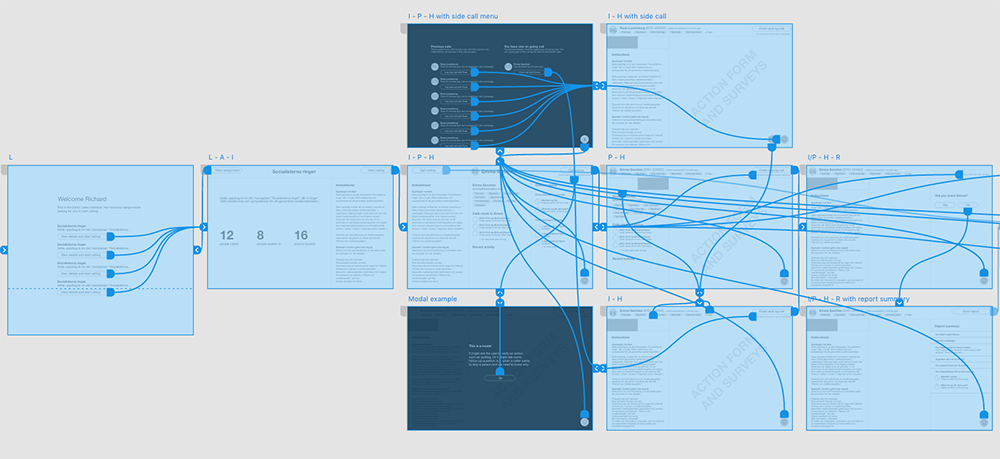

Zetkin handlar om att organisera aktivism. Vi lever som vi lär, och en stor del
av utvecklingen av Zetkin sker ideellt av aktivister som vill bidra med sina
tekniska kunskaper och sin tid.

Du är oerhört välkommen att bidra med din kompetens, till exempel inom följande
områden:

* Gränssnittsdesign och UX
* Utveckling, front-end (vi använder React.js)
* Utveckling, back-end (vi använder Node och Python)
* Mobil apputveckling
* GIS och kartverktyg
* Linux-system, Docker och operations

Du är självklart också välkommen med idéer på helt egna applikationer. Det
finns flera vägar in i utvecklingen.

## Hackathons
Ungefär varannan vecka anordnar Zetkin Foundation hackathons i Malmö. Man kan
också delta på distans. För dem som deltar på plats bjuder vi på frukost.

> Vill du anordna hackathon i din egen stad? Kontakta oss på
> [info@zetkin.org](mailto:info@zetkin.org).

På hackathons samlas en handfull utvecklare för att arbeta tillsammans. Ibland
i team, ibland individuellt. Alla som vill får en uppgift att jobba med under
dagen.

När du går hem från ett hackathon ska du inte behöva känna dig stressad över
den uppgift du åtagit dig. Därför försöker vi utforma alla uppgifter så att
man ska hinna klart innan dagen är slut.

Håll koll på [zetkin.org](http://zetkin.org) efter nästa hackathon.

## Vår öppna källkod på GitHub
På [Zetkin Foundations GitHub](https://github.com/zetkin) finns flera appar
och bibliotek som är open-source. Mest anmärkningsvärda är Zetkins tre stora
front-ends, [Aktivistportalen](https://github.com/zetkin/www.zetk.in),
[Zetkin Call](https://github.com/zetkin/call.zetk.in) och
[Zetkin Organize](https://github.com/zetkin/organize.zetk.in).

Ett enkelt sätt att komma in i utvecklingen är att läsa kod och dokumentation
för dessa, titta i respektive projekts lista över issues och ta sig an någon
av de buggar eller förbättringsförslag som finns där.

## Kommunikation
### Slack
Alla som vill bidra till Zetkin är välkomna att komma med i vårt team i
[chattjänsten Slack](https://zetkin.slack.com). Där diskuterar både ideella
och Zetkin Foundations egna utvecklare idéer och lösningar för Zetkin.

För att få tillgång till vår Slack måste du bli inbjuden. Skicka ett mail till
[info@zetkin.org](mailto:info@zetkin.org) om du vill få en inbjudan.

### Utvecklingsblogg
På [vår utvecklingsblogg](http://blog.zetkin.org) bloggar vi kontinuerligt (på
engelska) om utvecklingen av Zetkin. Där finns dels en hel del historik om
tankarna bakom olika tekniska beslut, dels anteckningar från varje hackathon.
