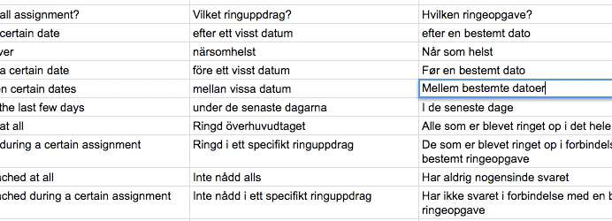
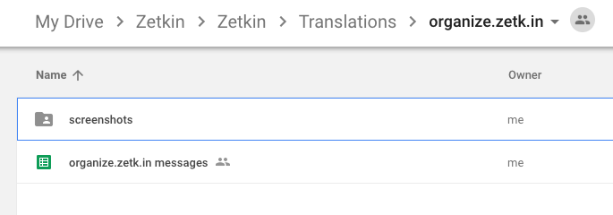
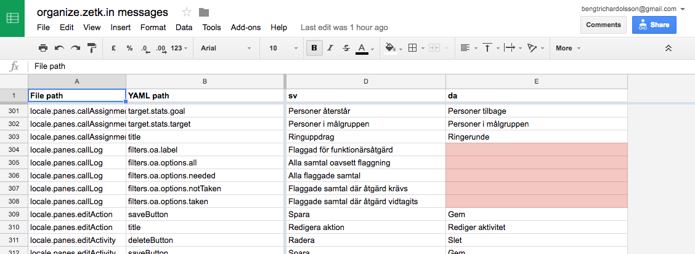

Zetkin utvecklas konstant, vilket innebär att behovet av översättningar är
ständigt. Varje release behövs nya översättningar, men sällan särskilt mycket
åt gången. Dessutom krävs minimalt med tekniska kunskaper, vilket gör
översättning till ett utmärkt sätt att komma igång med att bidra till Zetkins
utveckling.

> Det enklaste sättet att översätta är med Google Spreadsheets.



## Innan du sätter igång
### Lär känna Zetkin
För att komma igång med att översätta är det viktigt att förstå att Zetkin
består av tre separata webbapplikationer som utvecklas parallellt. De tre
apparna är Aktivistportalen (www.zetk.in), Zetkin Organize (organize.zetk.in)
och Zetkin Call (call.zetk.in). Eftersom de tre apparna är separata är även
deras översättningar det.

### Välj en metod
Du kan översätta Zetkin på två sätt. Det enklaste sättet är att använda
Google Spreadsheets och uppdatera stora översättningsark där all text från
Zetkin på alla språk finns samlat. För detta krävs endast minimalt med teknisk
kunskap, lite erfarenhet av Google Spreadsheets eller Microsoft Excel, och ett
Google-konto.

Om du har djupare teknisk kunskap, samt erfarenhet av att använda git och
GitHub kan du istället bidra med översättningar direkt i Zetkins källkod.

Fortsätt läsa för det enkla sättet, eller hoppa direkt till instruktioner om att
[översätta med hjälp av git](#om-du-är-bekant-med-git) och GitHub.

## Det enkla sättet
Att översätta med hjälp av Google Spreadsheets är det enklaste sättet. Det
består av några enkla steg:

1. Be om tillgång till översättningarna (endast första gången)
2. Hitta texter som saknas på ditt språk (eller lägg till ditt språk)
3. Översätt text som saknas
4. Meddela att du är klar

### 1. Få tillgång till översättningar
Innan du kan börja översätta måste du få tillgång till den Google Drive-mapp
där alla översättningar finns. Hör av dig till [info@zetkin.org](mailto:info@zetkin.org)
så ger vi dig tillgång till mappen _Translations_.

I mappen finns tre undermappar, en för varje applikation. I respektive mapp
finns ett spreadsheet som i sin tur innehåller alla texter.



### 2. Hitta vad som behöver översättas
Varje spreadsheet för respektive app fungerar likadant. De första två kolumnerna
innehåller textens namn för identifikation. Sedan följer en kolumn per språk.
Tomma celler markeras med röd bakgrund. Det är dessa som behöver översättas



### 3. Översätt till ditt språk
Utgå ifrån de övriga språken och textens ID för att lista ut en bra
översättning. Du kan också se ifall det finns screenshots i Drive-mappen som kan
hjälpa dig förstå sammanhanget.

Översätt sedan alla de rödmarkerade texter som saknas på ditt språk.

Vissa strängar innehåller variabler, alltså fält som fylls i utav programkoden,
exempelvis namn på användaren, platsen för en aktion eller dylikt. Dessa märks
ut med måsvingar (`{}`), exempelvis _Inloggad som { firstName } { lastName }_.
Se till att följa samma mönster som de övriga språken.

Andra strängar är mer komplicerade därför att de kräver olika översättningar i
olika grammatiska sammanhang, exempelvis för singular eller plural. Försök att
urskilja de delar av texten som behöver översättas, och översätt dem. Lägg inte
för mycket energi på teknisk syntax, som någon av våra programmerare kan ordna
i efterhand.

Tänk dig följande exempel:

```
{count, plural,
    =0 {Filtrera på kampanjer}
    =1 {Filtrerar på en kampanj}
    other {Filtrerar på # kampanjer}
}
```

Här är det texterna _Filtrera på kampanjer_, _Filtrerar på en kampanj_ och
_Filtrerar på # kampanjer_ som behöver översättas. Så länge dessa tre
varianter finns översatta och går att urskilja i din översättning behöver du
inte bry dig om all den tekniska koden.

### 4. Meddela när du är klar
När du är klar med alla översättningar till en applikation, eller så många som
du känner att du kan bidra med, meddela oss [via mail](mailto:info@zetkin.org)
så kontrollerar vi översättningen och importerar den in i Zetkin.

## Om du är bekant med git
Ifall du har erfarenhet av programmering och [verktyget git](https://git-scm.com)
och föredrar att använda dig av det kan du istället översätta och skicka in
ditt bidrag via GitHub.

Var och en av våra tre applikationer har ett eget repository på GitHub. Som
exempel kan vi använda [zetkin/www.zetk.in](https://github.com/zetkin/www.zetk.in)
som är det repo där koden till Aktivistportalen finns.

### Filstrukturen
I varje repo finns en katalog som heter _locale_ där översättningar finns. I
_locale_ finns YAML-filer som innehåller texten sorterade i olika
underkataloger vars sökvägar bildar unika ID-namn för varje text. Till exempel
finns katalogen _locale/pages/landing_ som utgör starten av ID på flera strängar
som börjar med `pages.landing`.

Varje språk har en egen YAML-fil i respektive katalog. Till exempel finns
filerna _sv.yaml_, _en.yaml_ och _da.yaml_ i _locale/pages/landing_. Filerna
innehåller en YAML-struktur där alla textsträngar finns. I den svenska filen
finns exempelvis `splash.h1` som innehåller texten "Delta i kampen för
rättvisa", huvudrubriken på Aktivistportalens startsida. Textens ID är alltså
`pages.landing.splash.h1`.

### Skapa en pull request
Som översättare förväntas du se till att den fil som motsvarar ditt språk
innehåller samma struktur som övriga språk, men med rätt översättning av texten.
Skapa en egen fork på GitHub, lägg till och/eller uppdatera YAML-filer för ditt
språk, och skapa sedan en pull request så kommer någon från Zetkin Foundation
att granska ditt bidrag och föra in det i Zetkin.
