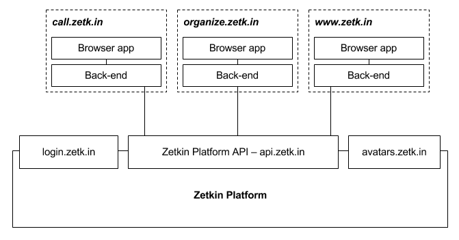

Internt är Zetkin Platform ett komplext system som hanterar all data, avancerade
funktioner såsom ringkön och smarta personsökningar samt utskick av e-post och
dylikt. Dessutom sköter plattformen all användarhantering och inloggningssidan
där alla användare loggar in är en del av plattformen.

Utifrån sett är Zetkin Platform ett API som du kan använda för att bygga appar
ovanpå. Faktum är att det är precis så som Zetkins officiella appar fungerar.

> Zetkins officiella appar Aktivistportalen, Zetkin Call och Zetkin Organize
> är alla byggda ovanpå Zetkin Platform.

Om du vill arbeta med den data som finns i Zetkin kan du bygga en väldigt enkel
applikation, helt utan egen datahantering, och bara använda Zetkin Platform API
för all hämtning och modifikationer av data.

Om du behöver utöka den data som finns med egen data kan du göra det genom att
använda egna databaser i din applikation och koppla samman data där med Zetkins
unika ID-nummer.
